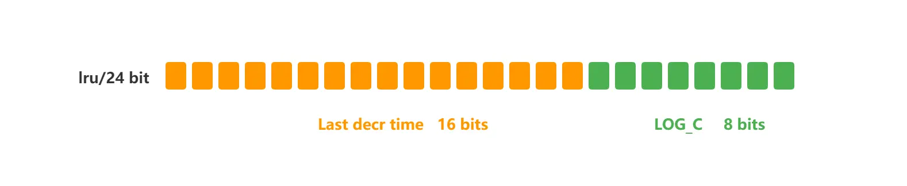

# Memory Obsolescence

当 Redis 的运行内存已经超过 Redis 设置的最大内存之后，则会使用内存淘汰策略删除符合条件的 key，以此来保障 Redis 高效的运行。

## 如何设置 Redis 最大运行内存？

在配置文件 redis.conf 中，可以通过参数 `maxmemory <bytes>` 来设定最大运行内存，只有在 Redis 的运行内存达到了我们设置的最大运行内存，才会触发内存淘汰策略。 不同位数的操作系统，maxmemory 的默认值是不同的：

* 在 64 位操作系统中，maxmemory 的默认值是 0，表示没有内存大小限制，那么不管用户存放多少数据到 Redis 中，Redis 也不会对可用内存进行检查，直到 Redis 实例因内存不足而崩溃也无作为。
* 在 32 位操作系统中，maxmemory 的默认值是 3G，因为 32 位的机器最大只支持 4GB 的内存，而系统本身就需要一定的内存资源来支持运行，所以 32 位操作系统限制最大 3 GB 的可用内存是非常合理的，这样可以避免因为内存不足而导致 Redis 实例崩溃。

## Redis 内存淘汰策略有哪些？

Redis 内存淘汰策略共有八种，这八种策略大体分为「不进行数据淘汰」和「进行数据淘汰」两类策略。

#### _1、不进行数据淘汰的策略_

**noeviction**（Redis3.0之后，默认的内存淘汰策略） ：它表示当运行内存超过最大设置内存时，不淘汰任何数据，这时如果有新的数据写入，会报错通知禁止写入，不淘汰任何数据，但是如果没用数据写入的话，只是单纯的查询或者删除操作的话，还是可以正常工作。

#### _2、进行数据淘汰的策略_

针对「进行数据淘汰」这一类策略，又可以细分为「在设置了过期时间的数据中进行淘汰」和「在所有数据范围内进行淘汰」这两类策略。

在设置了过期时间的数据中进行淘汰：

* **volatile-random**：随机淘汰设置了过期时间的任意键值；
* **volatile-ttl**：优先淘汰更早过期的键值。
* **volatile-lru**（Redis3.0 之前，默认的内存淘汰策略）：淘汰所有设置了过期时间的键值中，最久未使用的键值；
* **volatile-lfu**（Redis 4.0 后新增的内存淘汰策略）：淘汰所有设置了过期时间的键值中，最少使用的键值；

在所有数据范围内进行淘汰：

* **allkeys-random**：随机淘汰任意键值;
* **allkeys-lru**：淘汰整个键值中最久未使用的键值；
* **allkeys-lfu**（Redis 4.0 后新增的内存淘汰策略）：淘汰整个键值中最少使用的键值。

#### 查看当前 Redis 使用的内存淘汰策略

可以使用 `config get maxmemory-policy` 命令，来查看当前 Redis 的内存淘汰策略，命令如下：

```sh
127.0.0.1:6379> config get maxmemory-policy
1) "maxmemory-policy"
2) "noeviction"
```

#### 如何修改redis内存淘汰策略

设置内存淘汰策略有两种方法：

* 方式一：通过“`config set maxmemory-policy <策略>`”命令设置。它的优点是设置之后立即生效，不需要重启 Redis 服务，缺点是重启 Redis 之后，设置就会失效。
* 方式二：通过修改 Redis 配置文件修改，设置“`maxmemory-policy <策略>`”，它的优点是重启 Redis 服务后配置不会丢失，缺点是必须重启 Redis 服务，设置才能生效。

## LRU 算法和 LFU 算法区别 <a href="#lru-suan-fa-he-lfu-suan-fa-you-shen-me-qu-bie" id="lru-suan-fa-he-lfu-suan-fa-you-shen-me-qu-bie"></a>

### LRU

**LRU** 全称是 Least Recently Used 翻译为**最近最少使用**，会选择淘汰最近最少使用的数据。

传统 LRU 算法的实现是基于「链表」结构，链表中的元素按照操作顺序从前往后排列，最新操作的键会被移动到表头，当需要内存淘汰时，只需要删除链表尾部的元素即可，因为链表尾部的元素就代表最久未被使用的元素。

Redis 并没有使用这样的方式实现 LRU 算法，因为传统的 LRU 算法存在两个问题：

* 需要用链表管理所有的缓存数据，这会带来额外的空间开销；
* 当有数据被访问时，需要在链表上把该数据移动到头端，如果有大量数据被访问，就会带来很多链表移动操作，会很耗时，进而会降低 Redis 缓存性能。

#### redis实现LRU

Redis 实现的是一种**近似 LRU 算法**，目的是为了更好的节约内存，它的**实现方式是在 Redis 的对象结构体中添加一个额外的字段，用于记录此数据的最后一次访问时间**。

当 Redis 进行内存淘汰时，会使用**随机采样的方式来淘汰数据**，它是随机取 5 个值（此值可配置），然后**淘汰最久没有使用的那个**。

Redis 实现的 LRU 算法的优点：

* 不用为所有的数据维护一个大链表，节省了空间占用；
* 不用在每次数据访问时都移动链表项，提升了缓存的性能；

但是 LRU 算法有一个问题，**无法解决缓存污染问题**，比如应用一次读取了大量的数据，而这些数据只会被读取这一次，那么这些数据会留存在 Redis 缓存中很长一段时间，造成缓存污染。

### LFU

LFU 全称是 Least Frequently Used 翻译为**最近最不常用**，LFU 算法是根据数据访问次数来淘汰数据的，它的核心思想是“如果数据过去被访问多次，那么将来被访问的频率也更高”。

所以， LFU 算法会记录每个数据的访问次数。当一个数据被再次访问时，就会增加该数据的访问次数。这样就解决了偶尔被访问一次之后，数据留存在缓存中很长一段时间的问题，相比于 LRU 算法也更合理一些。

#### redis实现LFU

LFU 算法相比于 LRU 算法的实现，多记录了「数据的访问频次」的信息。Redis 对象的结构如下：

```c
typedef struct redisObject {
    ...
      
    // 24 bits，用于记录对象的访问信息
    unsigned lru:24;  
    ...
} robj;
```

Redis 对象头中的 lru 字段，在 LRU 算法下和 LFU 算法下使用方式并不相同。

**在 LRU 算法中**，Redis 对象头的 24 bits 的 lru 字段是用来记录 key 的访问时间戳，因此在 LRU 模式下，Redis可以根据对象头中的 lru 字段记录的值，来比较最后一次 key 的访问时间长，从而淘汰最久未被使用的 key。

**在 LFU 算法中**，Redis对象头的 24 bits 的 lru 字段被分成两段来存储，高 16bit 存储 ldt(Last Decrement Time)，低 8bit 存储 logc(Logistic Counter)。

<figure><figcaption><p>lfu</p></figcaption></figure>

* ldt 是用来记录 key 的访问时间戳；
* logc 是用来记录 key 的访问频次，它的值越小表示使用频率越低，越容易淘汰，每个新加入的 key 的logc 初始值为 5。

注意，logc 并不是单纯的访问次数，而是访问频次（访问频率），因为 **logc 会随时间推移而衰减的**。

在每次 key 被访问时，会先对 logc 做一个衰减操作，衰减的值跟前后访问时间的差距有关系，如果上一次访问的时间与这一次访问的时间差距很大，那么衰减的值就越大，这样实现的 LFU 算法是根据**访问频率**来淘汰数据的，而不只是访问次数。访问频率需要考虑 key 的访问是多长时间段内发生的。key 的先前访问距离当前时间越长，那么这个 key 的访问频率相应地也就会降低，这样被淘汰的概率也会更大。

对 logc 做完衰减操作后，就开始对 logc 进行增加操作，增加操作并不是单纯的 + 1，而是根据概率增加，如果 logc 越大的 key，它的 logc 就越难再增加。

所以，Redis 在访问 key 时，对于 logc 是这样变化的：

1. 先按照上次访问距离当前的时长，来对 logc 进行衰减；
2. 然后，再按照一定概率增加 logc 的值

redis.conf 提供了两个配置项，用于调整 LFU 算法从而控制 logc 的增长和衰减：

* `lfu-decay-time` 用于调整 logc 的衰减速度，它是一个以分钟为单位的数值，默认值为1，lfu-decay-time 值越大，衰减越慢；
* `lfu-log-factor` 用于调整 logc 的增长速度，lfu-log-factor 值越大，logc 增长越慢。

