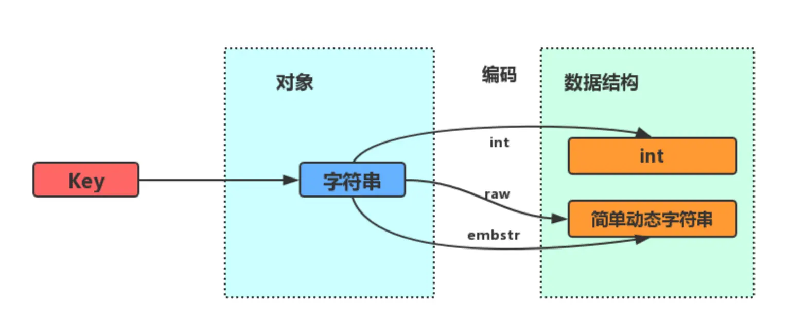

# Object

对象与数据结构的关系：

<figure><figcaption><p>object_struct</p></figcaption></figure>

> redis数据类型，常见有五种：**String（字符串），Hash（哈希），List（列表），Set（集合）、Zset（有序集合）**
>
> 随着 Redis 版本的更新，后面又支持了四种数据类型： **BitMap（2.2 版新增）、HyperLogLog（2.8 版新增）、GEO（3.2 版新增）、Stream（5.0 版新增）**

## String

String 是最基本的 key-value 结构，key 是唯一标识，value 是具体的值，value其实不仅是字符串， 也可以是数字（整数或浮点数），value 最多可以容纳的数据长度是 `512M`。

### 内部实现

String 类型的底层的数据结构实现主要是 int 和 SDS（简单动态字符串）

字符串对象的内部编码（encoding）有 3 种 ：**int、raw和 embstr**。

<figure><figcaption><p>string_struct</p></figcaption></figure>

如果一个字符串对象保存的是整数值，并且这个整数值可以用`long`类型来表示，那么字符串对象会将整数值保存在字符串对象结构的`ptr`属性里面（将`void*`转换成 long），并将字符串对象的编码设置为`int`。

如果字符串对象保存的是一个字符串，并且这个字符申的长度小于等于 32 字节（redis 2.+版本），那么字符串对象将使用一个简单动态字符串（SDS）来保存这个字符串，并将对象的编码设置为`embstr`， `embstr`编码是专门用于保存短字符串的一种优化编码方式。如果字符串的长度大于 32 字节（redis 2.+版本），那么字符串对象将使用一个简单动态字符串（SDS）来保存这个字符串，并将对象的编码设置为`raw`。

注意，embstr 编码和 raw 编码的边界在 redis 不同版本中是不一样的：

* redis 2.+ 是 32 字节
* redis 3.0-4.0 是 39 字节
* redis 5.0 是 44 字节

`embstr`和`raw`编码都会使用`SDS`来保存值，但不同之处在于`embstr`会通过一次内存分配函数来分配一块连续的内存空间来保存`redisObject`和`SDS`，而`raw`编码会通过调用两次内存分配函数来分别分配两块空间来保存`redisObject`和`SDS`。

* `embstr`编码将创建字符串对象所需的内存分配次数从 `raw` 编码的两次降低为一次；
* 释放 `embstr`编码的字符串对象同样只需要调用一次内存释放函数；
* 因为`embstr`编码的字符串对象的所有数据都保存在一块连续的内存里面可以更好的利用 CPU 缓存提升性能。

但是 embstr 也有缺点的：

* 如果字符串的长度增加需要重新分配内存时，整个redisObject和sds都需要重新分配空间，所以**embstr编码的字符串对象实际上是只读的**，redis没有为embstr编码的字符串对象编写任何相应的修改程序。当我们对embstr编码的字符串对象执行任何修改命令（例如append）时，程序会先将对象的编码从embstr转换成raw，然后再执行修改命令。

### 常用指令及应用

```sh
# 设置 key-value 类型的值
> SET name lin
OK
# 根据 key 获得对应的 value
> GET name
"lin"
# 返回 key 所储存的字符串值的长度
> STRLEN name
(integer) 3
# 不存在就插入（not exists）
>SETNX key value
(integer) 1
# 将 key 中储存的数字值增一
> INCR number
(integer) 1
# 将key中存储的数字值加 10
> INCRBY number 10
(integer) 11
# 将 key 中储存的数字值减一
> DECR number
(integer) 10
# 将key中存储的数字值键 10
> DECRBY number 10
(integer) 0

# 批量设置 key-value 类型的值
> MSET key1 value1 key2 value2 
OK
# 批量获取多个 key 对应的 value
> MGET key1 key2 
1) "value1"
2) "value2"
```

**应用：缓存对象、分布式锁**

**使用 String 来缓存对象有两种方式：**

* 直接缓存整个对象的 JSON，命令例子： `SET user:1 '{"name":"xiaolin", "age":18}'`。
* 采用将 key 进行分离为 user:ID:属性，采用 MSET 存储，用 MGET 获取各属性值，命令例子： `MSET user:1:name xiaolin user:1:age 18 user:2:name xiaomei user:2:age 20`。

**SET 命令有个 NX 参数可以实现「key不存在才插入」，可以用它来实现分布式锁：**

* 如果 key 不存在，则显示插入成功，可以用来表示加锁成功；
* 如果 key 存在，则会显示插入失败，可以用来表示加锁失败。

一般而言，还会对分布式锁加上过期时间，分布式锁的命令如下：

```
SET lock_key unique_value NX PX 10000
```

* lock\_key 就是 key 键；
* unique\_value 是客户端生成的唯一的标识；
* NX 代表只在 lock\_key 不存在时，才对 lock\_key 进行设置操作；
* PX 10000 表示设置 lock\_key 的过期时间为 10s，这是为了避免客户端发生异常而无法释放锁。

而解锁的过程就是将 lock\_key 键删除，但不能乱删，要保证执行操作的客户端就是加锁的客户端。所以，解锁的时候，我们要先判断锁的 unique\_value 是否为加锁客户端，是的话，才将 lock\_key 键删除。

## List

List 列表是简单的字符串列表，**按照插入顺序排序**，可以从头部或尾部向 List 列表添加元素。

列表的最大长度为 `2^32 - 1`，也即每个列表支持超过 `40 亿`个元素。

### 内部实现

List 类型的底层数据结构是由**双向链表或压缩列表**实现的：

* 如果列表的元素个数小于 `512` 个（默认值，可由 `list-max-ziplist-entries` 配置），列表每个元素的值都小于 `64` 字节（默认值，可由 `list-max-ziplist-value` 配置），Redis 会使用**压缩列表**作为 List 类型的底层数据结构；
* 如果列表的元素不满足上面的条件，Redis 会使用**双向链表**作为 List 类型的底层数据结构；

但是**在 Redis 3.2 版本之后，List 数据类型底层数据结构就只由 quicklist 实现了，替代了双向链表和压缩列表**。

### 常用命令及应用 <a href="#chang-yong-ming-ling" id="chang-yong-ming-ling"></a>

```sh
# 将一个或多个值value插入到key列表的表头(最左边)，最后的值在最前面
LPUSH key value [value ...] 
# 将一个或多个值value插入到key列表的表尾(最右边)
RPUSH key value [value ...]
# 移除并返回key列表的头元素
LPOP key     
# 移除并返回key列表的尾元素
RPOP key 

# 返回列表key中指定区间内的元素，区间以偏移量start和stop指定，从0开始
LRANGE key start stop

# 从key列表表头弹出一个元素，没有就阻塞timeout秒，如果timeout=0则一直阻塞
BLPOP key [key ...] timeout
# 从key列表表尾弹出一个元素，没有就阻塞timeout秒，如果timeout=0则一直阻塞
BRPOP key [key ...] timeout
```

**应用：消息队列**

**消息队列在存取消息时，要满足三个需求，分别是消息保序、处理重复的消息和保证消息可靠性**。

_1、如何满足消息保序需求？_

List 本身就是按先进先出的顺序对数据进行存取的，所以，如果使用 List 作为消息队列保存消息的话，就已经能满足消息保序的需求了。List 可以使用 LPUSH + RPOP （或者反过来，RPUSH+LPOP）命令实现消息队列。

BRPOP命令也称为阻塞式读取，客户端在没有读到队列数据时，自动阻塞，直到有新的数据写入队列，再开始读取新数据。和消费者程序自己不停地调用RPOP命令相比，这种方式能节省CPU开销。

_2、如何处理重复的消息？_

消费者要实现重复消息的判断，需要 2 个方面的要求：

* 每个消息都有一个全局的 ID。
* 消费者要记录已经处理过的消息的 ID。当收到一条消息后，消费者程序就可以对比收到的消息 ID 和记录的已处理过的消息 ID，来判断当前收到的消息有没有经过处理。如果已经处理过，那么，消费者程序就不再进行处理了。

但是List 并不会为每个消息生成 ID 号，所以我们需要自行为每个消息生成一个全局唯一ID

_3、如何保证消息可靠性？_

List 类型提供了 `BRPOPLPUSH` 命令，这个命令的作用是让消费者程序从一个 List 中读取消息，同时，Redis 会把这个消息再插入到另一个 List（可以叫作备份 List）留存。

缺陷：

List 不支持多个消费者消费同一条消息，因为一旦消费者拉取一条消息后，这条消息就从 List 中删除了，无法被其它消费者再次消费。

## Hash

Hash 是一个键值对（key - value）集合，其中 value 的形式如： `value=[{field1，value1}，...{fieldN，valueN}]`。Hash 特别适合用于存储对象。

### 内部实现

Hash 类型的底层数据结构是由**压缩列表或哈希表**实现的：

* 如果哈希类型元素个数小于 `512` 个（默认值，可由 `hash-max-ziplist-entries` 配置），所有值小于 `64` 字节（默认值，可由 `hash-max-ziplist-value` 配置）的话，Redis 会使用**压缩列表**作为 Hash 类型的底层数据结构；
* 如果哈希类型元素不满足上面条件，Redis 会使用**哈希表**作为 Hash 类型的 底层数据结构。

**在 Redis 7.0 中，压缩列表数据结构已经废弃了，交由 listpack 数据结构来实现了**。

### 常用命令及应用

```sh
# 存储一个哈希表key的键值
HSET key field value   
# 获取哈希表key对应的field键值
HGET key field

# 在一个哈希表key中存储多个键值对
HMSET key field value [field value...] 
# 批量获取哈希表key中多个field键值
HMGET key field [field ...]       
# 删除哈希表key中的field键值
HDEL key field [field ...]    

# 返回哈希表key中field的数量
HLEN key       
# 返回哈希表key中所有的键值
HGETALL key 

# 为哈希表key中field键的值加上增量n
HINCRBY key field n  
```

**应用：缓存对象**

Hash 类型的 （key，field， value） 的结构与对象的（对象id， 属性， 值）的结构相似，也可以用来存储对象。

## Set

Set 类型是一个无序并唯一的键值集合，它的存储顺序不会按照插入的先后顺序进行存储。

一个集合最多可以存储 `2^32-1` 个元素。概念和数学中个的集合基本类似，可以交集，并集，差集等等，所以 Set 类型除了支持集合内的增删改查，同时还支持多个集合取交集、并集、差集。

### 内部实现 <a href="#nei-bu-shi-xian-4" id="nei-bu-shi-xian-4"></a>

Set 类型的底层数据结构是由**哈希表或整数集合**实现的：

* 如果集合中的元素都是整数且元素个数小于 `512` （默认值，`set-maxintset-entries`配置）个，Redis 会使用**整数集合**作为 Set 类型的底层数据结构；
* 如果集合中的元素不满足上面条件，则 Redis 使用**哈希表**作为 Set 类型的底层数据结构。

### 常用命令及应用

```sh
# 往集合key中存入元素，元素存在则忽略，若key不存在则新建
SADD key member [member ...]
# 从集合key中删除元素
SREM key member [member ...] 
# 获取集合key中所有元素
SMEMBERS key
# 获取集合key中的元素个数
SCARD key

# 判断member元素是否存在于集合key中
SISMEMBER key member

# 从集合key中随机选出count个元素，元素不从key中删除
SRANDMEMBER key [count]
# 从集合key中随机选出count个元素，元素从key中删除
SPOP key [count]

# 交集运算
SINTER key [key ...]
# 将交集结果存入新集合destination中
SINTERSTORE destination key [key ...]

# 并集运算
SUNION key [key ...]
# 将并集结果存入新集合destination中
SUNIONSTORE destination key [key ...]

# 差集运算
SDIFF key [key ...]
# 将差集结果存入新集合destination中
SDIFFSTORE destination key [key ...]
```

集合的主要几个特性，无序、不可重复、支持并交差等操作。

**点赞、共同关注、抽奖活动**

## Zset

Zset 类型（有序集合类型）相比于 Set 类型多了一个排序属性 score（分值），对于有序集合 ZSet 来说，每个存储元素相当于有两个值组成的，一个是有序集合的元素值，一个是排序值。

### 内部实现 <a href="#nei-bu-shi-xian-5" id="nei-bu-shi-xian-5"></a>

Zset 类型的底层数据结构是由**压缩列表或跳表**实现的：

* 如果有序集合的元素个数小于 `128` 个，并且每个元素的值小于 `64` 字节时，Redis 会使用**压缩列表**作为 Zset 类型的底层数据结构；
* 如果有序集合的元素不满足上面的条件，Redis 会使用**跳表**作为 Zset 类型的底层数据结构；

**在 Redis 7.0 中，压缩列表数据结构已经废弃了，交由 listpack 数据结构来实现了。**

### 常用命令及应用

```sh
# 往有序集合key中加入带分值元素
ZADD key score member [[score member]...]   
# 往有序集合key中删除元素
ZREM key member [member...]                 
# 返回有序集合key中元素member的分值
ZSCORE key member
# 返回有序集合key中元素个数
ZCARD key 

# 为有序集合key中元素member的分值加上increment
ZINCRBY key increment member 

# 正序获取有序集合key从start下标到stop下标的元素
ZRANGE key start stop [WITHSCORES]
# 倒序获取有序集合key从start下标到stop下标的元素
ZREVRANGE key start stop [WITHSCORES]

# 返回有序集合中指定分数区间内的成员，分数由低到高排序。
ZRANGEBYSCORE key min max [WITHSCORES] [LIMIT offset count]

# 返回指定成员区间内的成员，按字典正序排列, 分数必须相同。
ZRANGEBYLEX key min max [LIMIT offset count]
# 返回指定成员区间内的成员，按字典倒序排列, 分数必须相同
ZREVRANGEBYLEX key max min [LIMIT offset count]

# 并集计算(相同元素分值相加)，numberkeys一共多少个key，WEIGHTS每个key对应的分值乘积
ZUNIONSTORE destkey numberkeys key [key...] 
# 交集计算(相同元素分值相加)，numberkeys一共多少个key，WEIGHTS每个key对应的分值乘积
ZINTERSTORE destkey numberkeys key [key...]
```

**应用：排行榜、电话、姓名排序**

## BitMap <a href="#bitmap" id="bitmap"></a>

Bitmap，即位图，是一串连续的二进制数组（0和1），可以通过偏移量（offset）定位元素。BitMap通过最小的单位bit来进行`0|1`的设置，表示某个元素的值或者状态，时间复杂度为O(1)。

由于 bit 是计算机中最小的单位，使用它进行储存将非常节省空间，特别适合一些数据量大且使用**二值统计的场景**。

### 内部实现 <a href="#nei-bu-shi-xian-6" id="nei-bu-shi-xian-6"></a>

Bitmap 本身是用 String 类型作为底层数据结构实现的一种统计二值状态的数据类型。

String 类型是会保存为二进制的字节数组，所以，Redis 就把字节数组的每个 bit 位利用起来，用来表示一个元素的二值状态，你可以把 Bitmap 看作是一个 bit 数组。

### 常用命令及应用 <a href="#chang-yong-ming-ling-5" id="chang-yong-ming-ling-5"></a>

```
# 设置值，其中value只能是 0 和 1
SETBIT key offset value

# 获取值
GETBIT key offset

# 获取指定范围内值为 1 的个数
# start 和 end 以字节为单位
BITCOUNT key start end

# BitMap间的运算
# operations 位移操作符，枚举值
  AND 与运算 &
  OR 或运算 |
  XOR 异或 ^
  NOT 取反 ~
# result 计算的结果，会存储在该key中
# key1 … keyn 参与运算的key，可以有多个，空格分割，not运算只能一个key
# 当 BITOP 处理不同长度的字符串时，较短的那个字符串所缺少的部分会被看作 0。返回值是保存到 destkey 的字符串的长度（以字节byte为单位），和输入 key 中最长的字符串长度相等。
BITOP [operations] [result] [key1] [keyn…]

# 返回指定key中第一次出现指定value(0/1)的位置
BITPOS [key] [value]
```

**应用：签到统计、判断用户登陆态、连续签到用户总数**

## HyperLogLog <a href="#hyperloglog" id="hyperloglog"></a>
