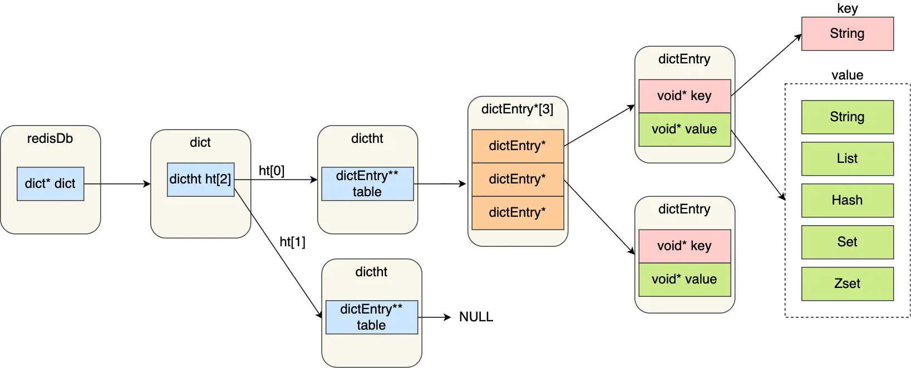

# Struct

> 目前redis新旧版共有9种数据结构
>
> SDS、双向链表、压缩列表、哈希表、跳表、整数集合、quicklist、listpack

## 键值对数据库

Redis 是使用了一个「哈希表」保存所有键值对，哈希表的最大好处就是让我们可以用 O(1) 的时间复杂度来快速查找到键值对。哈希表其实就是一个数组，数组中的元素叫做哈希桶。

哈希桶存放的是指向键值对数据的指针（dictEntry\*），这样通过指针就能找到键值对数据，然后因为键值对的值可以保存字符串对象和集合数据类型的对象，所以键值对的数据结构中并不是直接保存值本身，而是保存了 void \* key 和 void \* value 指针，分别指向了实际的键对象和值对象，这样一来，即使值是集合数据，也可以通过 void \* value 指针找到。

<figure><figcaption><p>struct_key_value</p></figcaption></figure>

* redisDb 结构，表示 Redis 数据库的结构，结构体里存放了指向了 dict 结构的指针；
* dict 结构，结构体里存放了 2 个哈希表，正常情况下都是用「哈希表1」，「哈希表2」只有在 rehash 的时候才用；
* ditctht 结构，表示哈希表的结构，结构里存放了哈希表数组，数组中的每个元素都是指向一个哈希表节点结构（dictEntry）的指针；
* dictEntry 结构，表示哈希表节点的结构，结构里存放了 \*\*void \* key 和 void \* value 指针， _key 指向的是 String 对象，而 value 则可以指向 String 对象，也可以指向集合类型的对象，比如 List 对象、Hash 对象、Set 对象和 Zset 对象_。

特别说明，void \* key 和 void \* value 指针指向的是 **Redis 对象**，Redis 中的每个对象都由 redisObject 结构表示。对象结构里包含的成员变量：

* type，标识该对象是什么类型的对象（String 对象、 List 对象、Hash 对象、Set 对象和 Zset 对象）；
* encoding，标识该对象使用了哪种底层的数据结构；
* **ptr，指向底层数据结构的指针**。

<figure><figcaption><p>struct_object</p></figcaption></figure>

## SDS

### C语言字符串

C 语言的字符串其实就是一个字符数组，即数组中每个元素是字符串中的一个字符。

在 C 语言里，对字符串操作时，char \* 指针只是指向字符数组的起始位置，而**字符数组的结尾位置就用“\0”表示，意思是指字符串的结束**。如果当前字符是 “\0” 是则说明字符串结束了

#### 缺陷

* **C 语言获取字符串长度的时间复杂度是 O（N）**
* **字符串里面不能含有 “\0” 字符（**不能保存像图片、音频、视频文化这样的二进制数据**）**
* **C 语言标准库中字符串的操作函数不安全，容易缓冲区溢出（**C 语言的字符串是不会记录自身的缓冲区大小的，使用像拼接函数时没有创建足够的缓冲区，则可能溢出造成程序终止，且拼接函数需要遍历才能完成追加，对字符串操作效率不高**）**

### SDS结构设计

结构中的每个成员变量分别介绍下：

* **len，记录了字符串长度**。这样获取字符串长度的时候，只需要返回这个成员变量值就行，时间复杂度只需要 O（1）。
* **alloc，分配给字符数组的空间长度**。这样在修改字符串的时候，可以通过 `alloc - len` 计算出剩余的空间大小，可以用来判断空间是否满足修改需求，如果不满足的话，就会自动将 SDS 的空间扩展至执行修改所需的大小，然后才执行实际的修改操作，所以使用 SDS 既不需要手动修改 SDS 的空间大小，也不会出现缓冲区溢出的问题。
* **flags，用来表示不同类型的 SDS**。一共设计了 5 种类型，分别是 sdshdr5、sdshdr8、sdshdr16、sdshdr32 和 sdshdr64，后面在说明区别之处。
* **buf\[]，字符数组，用来保存实际数据**。不仅可以保存字符串，也可以保存二进制数据。

总的来说，Redis 的 SDS 结构在原本字符数组之上，增加了三个元数据：len、alloc、flags，用来解决 C 语言字符串的缺陷。

SDS扩容规则如下：


```c
hisds hi_sdsMakeRoomFor(hisds s, size_t addlen)
{
    ... ...
    // s目前的剩余空间已足够，无需扩展，直接返回
    if (avail >= addlen)
        return s;
    //获取目前s的长度
    len = hi_sdslen(s);
    sh = (char *)s - hi_sdsHdrSize(oldtype);
    //扩展之后 s 至少需要的长度
    newlen = (len + addlen);
    //根据新长度，为s分配新空间所需要的大小
    if (newlen < HI_SDS_MAX_PREALLOC)
        //新长度<HI_SDS_MAX_PREALLOC 则分配所需空间*2的空间
        newlen *= 2;
    else
        //否则，分配长度为目前长度+1MB
        newlen += HI_SDS_MAX_PREALLOC;
       ...
}
```


* 如果所需的 sds 长度**小于 1 MB**，那么最后的扩容是按照**翻倍扩容**来执行的，即 2 倍的newlen
* 如果所需的 sds 长度**超过 1 MB**，那么最后的扩容长度应该是 newlen **+ 1MB**。

#### **节省内存空间**

SDS 结构中有个 flags 成员变量，表示的是 SDS 类型。

Redis 一共设计了 5 种类型，分别是 sdshdr5、sdshdr8、sdshdr16、sdshdr32 和 sdshdr64。

这 5 种类型的主要**区别就在于，它们数据结构中的 len 和 alloc 成员变量的数据类型不同**。

比如 sdshdr16 和 sdshdr32 这两个类型，它们的定义分别如下：

```c
struct __attribute__ ((__packed__)) sdshdr16 {
    uint16_t len;
    uint16_t alloc; 
    unsigned char flags; 
    char buf[];
};


struct __attribute__ ((__packed__)) sdshdr32 {
    uint32_t len;
    uint32_t alloc; 
    unsigned char flags;
    char buf[];
};
```

* sdshdr16 类型的 len 和 alloc 的数据类型都是 uint16\_t，表示字符数组长度和分配空间大小不能超过 2 的 16 次方。
* sdshdr32 则都是 uint32\_t，表示表示字符数组长度和分配空间大小不能超过 2 的 32 次方。

**之所以 SDS 设计不同类型的结构体，是为了能灵活保存不同大小的字符串，从而有效节省内存空间**。比如，在保存小字符串时，结构头占用空间也比较少。

除了设计不同类型的结构体，Redis 在编程上还**使用了专门的编译优化来节省内存空间**，即在 struct 声明了 `__attribute__ ((packed))` ，它的作用是：**告诉编译器取消结构体在编译过程中的优化对齐，按照实际占用字节数进行对齐**。

比如，sdshdr16 类型的 SDS，默认情况下，编译器会按照 2 字节对齐的方式给变量分配内存，这意味着，即使一个变量的大小不到 2 个字节，编译器也会给它分配 2 个字节。使用了`__attribute__ ((packed))`之后则不使用字节对齐方式分配内存，时间结构体占多少内存空间，编译器就分配多少空间

## 链表
