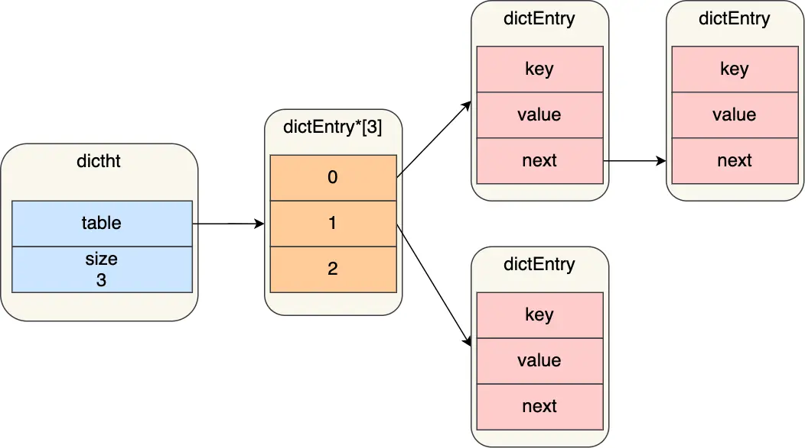
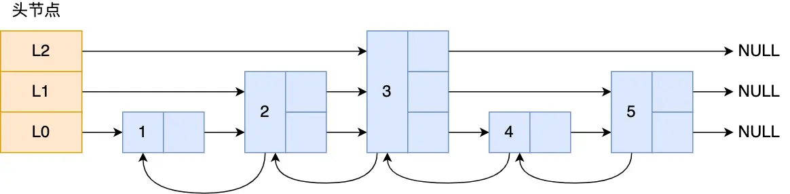

# Struct


> 目前redis新旧版共有9种数据结构
>
> 对象、SDS、双向链表、压缩列表、哈希表、整数集合、跳表、quicklist、listpack

## 键值对数据库

Redis 是使用了一个「哈希表」保存所有键值对，哈希表的最大好处就是让我们可以用 O(1) 的时间复杂度来快速查找到键值对。哈希表其实就是一个数组，数组中的元素叫做哈希桶。

哈希桶存放的是指向键值对数据的指针（dictEntry\*），这样通过指针就能找到键值对数据，然后因为键值对的值可以保存字符串对象和集合数据类型的对象，所以键值对的数据结构中并不是直接保存值本身，而是保存了 void \* key 和 void \* value 指针，分别指向了实际的键对象和值对象，这样一来，即使值是集合数据，也可以通过 void \* value 指针找到。

<figure><figcaption><p>struct_key_value</p></figcaption></figure>

* redisDb 结构，表示 Redis 数据库的结构，结构体里存放了指向了 dict 结构的指针；
* dict 结构，结构体里存放了 2 个哈希表，正常情况下都是用「哈希表1」，「哈希表2」只有在 rehash 的时候才用；
* ditctht 结构，表示哈希表的结构，结构里存放了哈希表数组，数组中的每个元素都是指向一个哈希表节点结构（dictEntry）的指针；
* dictEntry 结构，表示哈希表节点的结构，结构里存放了 \*\*void \* key 和 void \* value 指针， _key 指向的是 String 对象，而 value 则可以指向 String 对象，也可以指向集合类型的对象，比如 List 对象、Hash 对象、Set 对象和 Zset 对象_。

特别说明，void \* key 和 void \* value 指针指向的是 **Redis 对象**，Redis 中的每个对象都由 redisObject 结构表示。对象结构里包含的成员变量：

* type，标识该对象是什么类型的对象（String 对象、 List 对象、Hash 对象、Set 对象和 Zset 对象）；
* encoding，标识该对象使用了哪种底层的数据结构；
* **ptr，指向底层数据结构的指针**。

<figure><figcaption><p>struct_object</p></figcaption></figure>

## SDS

### C语言字符串

C 语言的字符串其实就是一个字符数组，即数组中每个元素是字符串中的一个字符。

在 C 语言里，对字符串操作时，char \* 指针只是指向字符数组的起始位置，而**字符数组的结尾位置就用“\0”表示，意思是指字符串的结束**。如果当前字符是 “\0” 是则说明字符串结束了

#### 缺陷

* **C 语言获取字符串长度的时间复杂度是 O（N）**
* **字符串里面不能含有 “\0” 字符（**不能保存像图片、音频、视频文化这样的二进制数据**）**
* **C 语言标准库中字符串的操作函数不安全，容易缓冲区溢出（**C 语言的字符串是不会记录自身的缓冲区大小的，使用像拼接函数时没有创建足够的缓冲区，则可能溢出造成程序终止，且拼接函数需要遍历才能完成追加，对字符串操作效率不高**）**

### SDS结构设计

结构中的每个成员变量分别介绍下：

* **len，记录了字符串长度**。这样获取字符串长度的时候，只需要返回这个成员变量值就行，时间复杂度只需要 O（1）。
* **alloc，分配给字符数组的空间长度**。这样在修改字符串的时候，可以通过 `alloc - len` 计算出剩余的空间大小，可以用来判断空间是否满足修改需求，如果不满足的话，就会自动将 SDS 的空间扩展至执行修改所需的大小，然后才执行实际的修改操作，所以使用 SDS 既不需要手动修改 SDS 的空间大小，也不会出现缓冲区溢出的问题。
* **flags，用来表示不同类型的 SDS**。一共设计了 5 种类型，分别是 sdshdr5、sdshdr8、sdshdr16、sdshdr32 和 sdshdr64，后面在说明区别之处。
* **buf\[]，字符数组，用来保存实际数据**。不仅可以保存字符串，也可以保存二进制数据。

总的来说，Redis 的 SDS 结构在原本字符数组之上，增加了三个元数据：len、alloc、flags，用来解决 C 语言字符串的缺陷。

SDS扩容规则如下：


```c
hisds hi_sdsMakeRoomFor(hisds s, size_t addlen)
{
    ... ...
    // s目前的剩余空间已足够，无需扩展，直接返回
    if (avail >= addlen)
        return s;
    //获取目前s的长度
    len = hi_sdslen(s);
    sh = (char *)s - hi_sdsHdrSize(oldtype);
    //扩展之后 s 至少需要的长度
    newlen = (len + addlen);
    //根据新长度，为s分配新空间所需要的大小
    if (newlen < HI_SDS_MAX_PREALLOC)
        //新长度<HI_SDS_MAX_PREALLOC 则分配所需空间*2的空间
        newlen *= 2;
    else
        //否则，分配长度为目前长度+1MB
        newlen += HI_SDS_MAX_PREALLOC;
       ...
}
```


* 如果所需的 sds 长度**小于 1 MB**，那么最后的扩容是按照**翻倍扩容**来执行的，即 2 倍的newlen
* 如果所需的 sds 长度**超过 1 MB**，那么最后的扩容长度应该是 newlen **+ 1MB**。

#### **节省内存空间**

SDS 结构中有个 flags 成员变量，表示的是 SDS 类型。

Redis 一共设计了 5 种类型，分别是 sdshdr5、sdshdr8、sdshdr16、sdshdr32 和 sdshdr64。

这 5 种类型的主要**区别就在于，它们数据结构中的 len 和 alloc 成员变量的数据类型不同**。

比如 sdshdr16 和 sdshdr32 这两个类型，它们的定义分别如下：

```c
struct __attribute__ ((__packed__)) sdshdr16 {
    uint16_t len;
    uint16_t alloc; 
    unsigned char flags; 
    char buf[];
};


struct __attribute__ ((__packed__)) sdshdr32 {
    uint32_t len;
    uint32_t alloc; 
    unsigned char flags;
    char buf[];
};
```

* sdshdr16 类型的 len 和 alloc 的数据类型都是 uint16\_t，表示字符数组长度和分配空间大小不能超过 2 的 16 次方。
* sdshdr32 则都是 uint32\_t，表示表示字符数组长度和分配空间大小不能超过 2 的 32 次方。

**之所以 SDS 设计不同类型的结构体，是为了能灵活保存不同大小的字符串，从而有效节省内存空间**。比如，在保存小字符串时，结构头占用空间也比较少。

除了设计不同类型的结构体，Redis 在编程上还**使用了专门的编译优化来节省内存空间**，即在 struct 声明了 `__attribute__ ((packed))` ，它的作用是：**告诉编译器取消结构体在编译过程中的优化对齐，按照实际占用字节数进行对齐**。

比如，sdshdr16 类型的 SDS，默认情况下，编译器会按照 2 字节对齐的方式给变量分配内存，这意味着，即使一个变量的大小不到 2 个字节，编译器也会给它分配 2 个字节。使用了`__attribute__ ((packed))`之后则不使用字节对齐方式分配内存，时间结构体占多少内存空间，编译器就分配多少空间

## 链表

Redis 的 List 对象的底层实现之一就是链表。C 语言本身没有链表这个数据结构的，所以 Redis 自己设计了一个链表数据结构。

### 结构设计

```c
typedef struct listNode {
    //前置节点
    struct listNode *prev;
    //后置节点
    struct listNode *next;
    //节点的值
    void *value;
} listNode;
```

不过，Redis 在 listNode 结构体基础上又封装了 list 这个数据结构，这样操作起来会更方便，链表结构如下：

```c
typedef struct list {
    //链表头节点
    listNode *head;
    //链表尾节点
    listNode *tail;
    //节点值复制函数
    void *(*dup)(void *ptr);
    //节点值释放函数
    void (*free)(void *ptr);
    //节点值比较函数
    int (*match)(void *ptr, void *key);
    //链表节点数量
    unsigned long len;
} list;
```

list 结构为链表提供了链表头指针 head、链表尾节点 tail、链表节点数量 len、以及可以自定义实现的 dup、free、match 函数。

### 链表优势及缺陷

优点：

* listNode 链表节点的结构里带有 prev 和 next 指针，**获取某个节点的前置节点或后置节点的时间复杂度只需O(1)，而且这两个指针都可以指向 NULL，所以链表是无环链表**；
* list 结构因为提供了表头指针 head 和表尾节点 tail，所以**获取链表的表头节点和表尾节点的时间复杂度只需O(1)**；
* list 结构因为提供了链表节点数量 len，所以**获取链表中的节点数量的时间复杂度只需O(1)**；
* listNode 链表节使用 void\* 指针保存节点值，并且可以通过 list 结构的 dup、free、match 函数指针为节点设置该节点类型特定的函数，因此**链表节点可以保存各种不同类型的值**；

缺陷：

* 链表每个节点之间的内存都是不连续的，意味着**无法很好利用 CPU 缓存**。能很好利用 CPU 缓存的数据结构就是数组，因为数组的内存是连续的，这样就可以充分利用 CPU 缓存来加速访问。
* 还有一点，保存一个链表节点的值都需要一个链表节点结构头的分配，**内存开销较大**。

因此，Redis 3.0 的 List 对象在数据量比较少的情况下，会采用「压缩列表」作为底层数据结构的实现，它的优势是节省内存空间，并且是内存紧凑型的数据结构。

## 压缩列表

压缩列表的最大特点，就是它被设计成一种内存紧凑型的数据结构，占用一块连续的内存空间，不仅可以利用 CPU 缓存，而且会针对不同长度的数据，进行相应编码，这种方法可以有效地节省内存开销。

但是，压缩列表的缺陷也是有的：

* 不能保存过多的元素，否则查询效率就会降低；
* 新增或修改某个元素时，压缩列表占用的内存空间需要重新分配，甚至可能引发连锁更新的问题。

因此，Redis 对象（List 对象、Hash 对象、Zset 对象）包含的元素数量较少，或者元素值不大的情况才会使用压缩列表作为底层数据结构。

### 结构设计

<figure><figcaption><p>compress_list_struct</p></figcaption></figure>

压缩列表表头表尾：

* _**zlbytes**_，记录整个压缩列表占用对内存字节数；
* _**zltail**_，记录压缩列表「尾部」节点距离起始地址由多少字节，也就是列表尾的偏移量；
* _**zllen**_，记录压缩列表包含的节点数量；
* _**zlend**_，标记压缩列表的结束点，固定值 0xFF（十进制255）。

如果我们要查找定位第一个元素和最后一个元素，可以通过表头三个字段（zllen）的长度直接定位，复杂度是 O(1)。而**查找其他元素时，就没有这么高效了，只能逐个查找，此时的复杂度就是 O(N) 了，因此压缩列表不适合保存过多的元素**

压缩列表节点包含三部分内容：

* _**prevlen**_，记录了「前一个节点」的长度，目的是为了实现从后向前遍历；
* _**encoding**_，记录了当前节点实际数据的「类型和长度」，类型主要有两种：字符串和整数。
* _**data**_，记录了当前节点的实际数据，类型和长度都由 `encoding` 决定；

往压缩列表中插入数据时，压缩列表就会根据数据类型是字符串还是整数，以及数据的大小，会使用不同空间大小的 prevlen 和 encoding 这两个元素里保存的信息，**这种根据数据大小和类型进行不同的空间大小分配的设计思想，正是 Redis 为了节省内存而采用的**。

分别说下，prevlen 和 encoding 是如何根据数据的大小和类型来进行不同的空间大小分配。

压缩列表里的每个节点中的 prevlen 属性都记录了「前一个节点的长度」，而且 prevlen 属性的空间大小跟前一个节点长度值有关，比如：

* 如果**前一个节点的长度小于 254 字节**，那么 prevlen 属性需要用 **1 字节的空间**来保存这个长度值；
* 如果**前一个节点的长度大于等于 254 字节**，那么 prevlen 属性需要用 **5 字节的空间**来保存这个长度值；

### 连锁更新

**压缩列表新增某个元素或修改某个元素时，如果空间不不够，压缩列表占用的内存空间就需要重新分配。而当新插入的元素较大时，可能会导致后续元素的 prevlen 占用空间都发生变化，从而引起「连锁更新」问题，导致每个元素的空间都要重新分配，造成访问压缩列表性能的下降**。

<figure><figcaption><p>compress_list_chain_renewal</p></figcaption></figure>

因为 e1 节点的 prevlen 属性只有 1 个字节大小，无法保存新节点的长度，此时就需要对压缩列表的空间重分配操作，并将 e1 节点的 prevlen 属性从原来的 1 字节大小扩展为 5 字节大小。

e1 原本的长度在 250～253 之间，因为刚才的扩展空间，此时 e1 的长度就大于等于 254 了，因此原本 e2 保存 e1 的 prevlen 属性也必须从 1 字节扩展至 5 字节大小。

正如扩展 e1 引发了对 e2 扩展一样，扩展 e2 也会引发对 e3 的扩展，而扩展 e3 又会引发对 e4 的扩展.... 一直持续到结尾。

### 缺陷

空间扩展操作也就是重新分配内存，因此**连锁更新一旦发生，就会导致压缩列表占用的内存空间要多次重新分配，这就会直接影响到压缩列表的访问性能**。

所以说，**虽然压缩列表紧凑型的内存布局能节省内存开销，但是如果保存的元素数量增加了，或是元素变大了，会导致内存重新分配，最糟糕的是会有「连锁更新」的问题**。

因此，**压缩列表只会用于保存的节点数量不多的场景**，只要节点数量足够小，即使发生连锁更新，也是能接受的。

## 哈希表

### 结构设计

```c
typedef struct dictht {
    //哈希表数组
    dictEntry **table;
    //哈希表大小
    unsigned long size;  
    //哈希表大小掩码，用于计算索引值
    unsigned long sizemask;
    //该哈希表已有的节点数量
    unsigned long used;
} dictht;
```

可以看到，哈希表是一个数组（dictEntry \*\*table），数组的每个元素是一个指向「哈希表节点（dictEntry）」的指针。

<figure><figcaption><p>dictht</p></figcaption></figure>

节点结构

```c
typedef struct dictEntry {
    //键值对中的键
    void *key;
  
    //键值对中的值
    union {
        void *val;
        uint64_t u64;
        int64_t s64;
        double d;
    } v;
    //指向下一个哈希表节点，形成链表
    struct dictEntry *next;
} dictEntry;
```

dictEntry 结构里键值对中的值是一个「联合体 v」定义的，因此，键值对中的值可以是一个指向实际值的指针，或者是一个无符号的 64 位整数或有符号的 64 位整数或double 类的值。这么做的好处是可以节省内存空间，因为当「值」是整数或浮点数时，就可以将值的数据内嵌在 dictEntry 结构里，无需再用一个指针指向实际的值，从而节省了内存空间。

### 哈希冲突

Redis 采用了「**链式哈希**」的方法来解决哈希冲突。

链式哈希局限性也很明显，随着链表长度的增加，在查询这一位置上的数据的耗时就会增加

要想解决这一问题，就需要进行 rehash，也就是对哈希表的大小进行扩展。

### rehash

redis使用dictht结构体表示哈希表，但实际使用时，定义了一个dict结构体

```c
typedef struct dict {
    …
    //两个Hash表，交替使用，用于rehash操作
    dictht ht[2]; 
    …
} dict;
```

之所以定义了 2 个哈希表，是因为进行 rehash 的时候，需要用上 2 个哈希表了。

在正常服务请求阶段，插入的数据，都会写入到「哈希表 1」，此时的「哈希表 2 」 并没有被分配空间。

随着数据逐步增多，触发了 rehash 操作，这个过程分为三步：

* 给「哈希表 2」 分配空间，一般会比「哈希表 1」 大一倍（两倍的意思）；
* 将「哈希表 1 」的数据迁移到「哈希表 2」 中；
* 迁移完成后，「哈希表 1 」的空间会被释放，并把「哈希表 2」 设置为「哈希表 1」，然后在「哈希表 2」 新创建一个空白的哈希表，为下次 rehash 做准备。

这个过程看起来简单，但是其实第二步很有问题，**如果「哈希表 1 」的数据量非常大，那么在迁移至「哈希表 2 」的时候，因为会涉及大量的数据拷贝，此时可能会对 Redis 造成阻塞，无法服务其他请求**。

### 渐进式rehash

渐进式 rehash 步骤如下：

* 给「哈希表 2」 分配空间；
* **在 rehash 进行期间，每次哈希表元素进行新增、删除、查找或者更新操作时，Redis 除了会执行对应的操作之外，还会顺序将「哈希表 1 」中索引位置上的所有 key-value 迁移到「哈希表 2」 上**；
* 随着处理客户端发起的哈希表操作请求数量越多，最终在某个时间点会把「哈希表 1 」的所有 key-value 迁移到「哈希表 2」，从而完成 rehash 操作。

这样就巧妙地把一次性大量数据迁移工作的开销，分摊到了多次处理请求的过程中，避免了一次性 rehash 的耗时操作。

在进行渐进式 rehash 的过程中，会有两个哈希表，所以在渐进式 rehash 进行期间，哈希表元素的删除、查找、更新等操作都会在这两个哈希表进行。

比如，查找一个 key 的值的话，先会在「哈希表 1」 里面进行查找，如果没找到，就会继续到哈希表 2 里面进行找到。

另外，在渐进式 rehash 进行期间，新增一个 key-value 时，会被保存到「哈希表 2 」里面，而「哈希表 1」 则不再进行任何添加操作，这样保证了「哈希表 1 」的 key-value 数量只会减少，随着 rehash 操作的完成，最终「哈希表 1 」就会变成空表。

### rehash触发条件

rehash 的触发条件跟\*\*负载因子（load factor）\*\*有关系。

负载因子可以通过下面这个公式计算：

$$
负载因子 = 哈希表已保存节点数量/哈希表大小
$$

触发 rehash 操作的条件，主要有两个：

* **当负载因子大于等于 1 ，并且 Redis 没有在执行 bgsave 命令或者 bgrewiteaof 命令，也就是没有执行 RDB 快照或没有进行 AOF 重写的时候，就会进行 rehash 操作。**
* **当负载因子大于等于 5 时，此时说明哈希冲突非常严重了，不管有没有有在执行 RDB 快照或 AOF 重写，都会强制进行 rehash 操作。**

## 整数集合

整数集合是 Set 对象的底层实现之一。当一个 Set 对象只包含整数值元素，并且元素数量不大时，就会使用整数集这个数据结构作为底层实现。

### 结构设计

整数集合本质上是一块连续内存空间，

```c
typedef struct intset {
    //编码方式
    uint32_t encoding;
    //集合包含的元素数量
    uint32_t length;
    //保存元素的数组
    int8_t contents[];
} intset;
```

保存元素的容器是一个 contents 数组，虽然 contents 被声明为 int8\_t 类型的数组，但是实际上 contents 数组并不保存任何 int8\_t 类型的元素，contents 数组的真正类型取决于 intset 结构体里的 encoding 属性的值。比如：

* 如果 encoding 属性值为 INTSET\_ENC\_INT16，那么 contents 就是一个 int16\_t 类型的数组，数组中每一个元素的类型都是 int16\_t；
* 如果 encoding 属性值为 INTSET\_ENC\_INT32，那么 contents 就是一个 int32\_t 类型的数组，数组中每一个元素的类型都是 int32\_t；
* 如果 encoding 属性值为 INTSET\_ENC\_INT64，那么 contents 就是一个 int64\_t 类型的数组，数组中每一个元素的类型都是 int64\_t；

不同类型的 contents 数组，意味着数组的大小也会不同。

#### 整数集合的升级操作 <a href="#zheng-shu-ji-he-de-sheng-ji-cao-zuo" id="zheng-shu-ji-he-de-sheng-ji-cao-zuo"></a>

整数集合会有一个升级规则，就是当我们将一个新元素加入到整数集合里面，如果新元素的类型（int32\_t）比整数集合现有所有元素的类型（int16\_t）都要长时，整数集合需要先进行升级，也就是按新元素的类型（int32\_t）扩展 contents 数组的空间大小，然后才能将新元素加入到整数集合里，当然升级的过程中，也要维持整数集合的有序性。

整数集合升级的过程不会重新分配一个新类型的数组，而是在原本的数组上扩展空间，然后在将每个元素按间隔类型大小分割，如果 encoding 属性值为 INTSET\_ENC\_INT16，则每个元素的间隔就是 16 位。

eg：一个集合里有3个int16\_t的元素，新加入一个int32\_t的元素

1. **升级扩容**，在原本空间的大小之上再扩容多 80 位（4x32-3x16=80），这样就能保存下 4 个类型为 int32\_t 的元素。
2.  **维持有序不变**


    <figure><figcaption><p>intset_dilatation_ensure</p></figcaption></figure>

如果一直向整数集合添加 int16\_t 类型的元素，那么整数集合的底层实现就一直是用 int16\_t 类型的数组，只有在我们要将 int32\_t 类型或 int64\_t 类型的元素添加到集合时，才会对数组进行升级操作。

因此，整数集合升级的好处是**节省内存资源**。

**不支持降级操作**，一旦对数组进行了升级，就会一直保持升级后的状态。比如前面的升级操作的例子，如果删除了 65535 元素，整数集合的数组还是 int32\_t 类型的，并不会因此降级为 int16\_t 类型。

## 跳表

Redis 只有 Zset 对象的底层实现用到了跳表，跳表的优势是能支持平均 O(logN) 复杂度的节点查找。

### 结构设计

zset 结构体里有两个数据结构：一个是跳表，一个是哈希表。这样的好处是既能进行高效的范围查询，也能进行高效单点查询。

```c
typedef struct zset {
    dict *dict;
    zskiplist *zsl;
} zset;
```

Zset 对象在执行数据插入或是数据更新的过程中，会依次在跳表和哈希表中插入或更新相应的数据，从而保证了跳表和哈希表中记录的信息一致。

Zset 对象能支持范围查询（如 ZRANGEBYSCORE 操作），这是因为它的数据结构设计采用了跳表，而又能以常数复杂度获取元素权重（如 ZSCORE 操作），这是因为它同时采用了哈希表进行索引。

#### 跳表结构设计

```c
typedef struct zskiplist {
    struct zskiplistNode *header, *tail;
    unsigned long length;
    int level;
} zskiplist;
```

跳表结构里包含了：

* 跳表的头尾节点，便于在O(1)时间复杂度内访问跳表的头节点和尾节点；
* 跳表的长度，便于在O(1)时间复杂度获取跳表节点的数量；
* 跳表的最大层数，便于在O(1)时间复杂度获取跳表中层高最大的那个节点的层数量

链表在查找元素的时候，因为需要逐一查找，所以查询效率非常低，时间复杂度是O(N)，于是就出现了跳表。**跳表是在链表基础上改进过来的，实现了一种「多层」的有序链表**，这样的好处是能快读定位数据。

<figure><figcaption><p>zskiplist</p></figcaption></figure>

图中展示了一个层级为 3 的跳表，头节点有 L0\~L2 三个头指针，分别指向了不同层级的节点，然后每个层级的节点都通过指针连接起来：

* L0 层级共有 5 个节点，分别是节点1、2、3、4、5；
* L1 层级共有 3 个节点，分别是节点 2、3、5；
* L2 层级只有 1 个节点，也就是节点 3 。

#### 跳表节点设计

```c
typedef struct zskiplistNode {
    //Zset 对象的元素值
    sds ele;
    //元素权重值
    double score;
    //后向指针
    struct zskiplistNode *backward;
  
    //节点的level数组，保存每层上的前向指针和跨度
    struct zskiplistLevel {
        struct zskiplistNode *forward;
        unsigned long span;
    } level[];
} zskiplistNode;
```

Zset 对象要同时保存「元素」和「元素的权重」，对应到跳表节点结构里就是 sds 类型的 ele 变量和 double 类型的 score 变量。每个跳表节点都有一个后向指针（struct zskiplistNode \*backward），指向前一个节点，目的是为了方便从跳表的尾节点开始访问节点，这样倒序查找时很方便。

跳表是一个带有层级关系的链表，而且每一层级可以包含多个节点，每一个节点通过指针连接起来，实现这一特性就是靠跳表节点结构体中的**zskiplistLevel 结构体类型的 level 数组**。

level 数组中的每一个元素代表跳表的一层，也就是由 zskiplistLevel 结构体表示，比如 leve\[0] 就表示第一层，leve\[1] 就表示第二层。zskiplistLevel 结构体里定义了「指向下一个跳表节点的指针」和「跨度」，跨度时用来记录两个节点之间的距离。

<figure><figcaption><p>zskiplist_span</p></figcaption></figure>

**跨度实际上是为了计算这个节点在跳表中的排位**。具体怎么做的呢？因为跳表中的节点都是按序排列的，那么计算某个节点排位的时候，从头节点点到该结点的查询路径上，将沿途访问过的所有层的跨度累加起来，得到的结果就是目标节点在跳表中的排位。

举个例子，查找图中节点 3 在跳表中的排位，从头节点开始查找节点 3，查找的过程只经过了一个层（L2），并且层的跨度是 3，所以节点 3 在跳表中的排位是 3。

另外，图中的头节点其实也是 zskiplistNode 跳表节点，只不过头节点的后向指针、权重、元素值都没有用到，所以图中省略了这部分。

### 跳表节点查询过程 <a href="#tiao-biao-jie-dian-cha-xun-guo-cheng" id="tiao-biao-jie-dian-cha-xun-guo-cheng"></a>

查找一个跳表节点的过程时，跳表会从头节点的最高层开始，逐一遍历每一层。在遍历某一层的跳表节点时，会用跳表节点中的 SDS 类型的元素和元素的权重来进行判断，共有两个判断条件：

* 如果当前节点的权重「小于」要查找的权重时，跳表就会访问该层上的下一个节点。
* 如果当前节点的权重「等于」要查找的权重时，并且当前节点的 SDS 类型数据「小于」要查找的数据时，跳表就会访问该层上的下一个节点。

如果上面两个条件都不满足，或者下一个节点为空时，跳表就会使用目前遍历到的节点的 level 数组里的下一层指针，然后沿着下一层指针继续查找，这就相当于跳到了下一层接着查找。

eg:

<figure><figcaption><p>zskiplist_search_process</p></figcaption></figure>

如果要查找「元素：abcd，权重：4」的节点，查找的过程是这样的：

* 先从头节点的最高层开始，L2 指向了「元素：abc，权重：3」节点，这个节点的权重比要查找节点的小，所以要访问该层上的下一个节点；
* 但是该层的下一个节点是空节点（ leve\[2]指向的是空节点），于是就会跳到「元素：abc，权重：3」节点的下一层去找，也就是 leve\[1];
* 「元素：abc，权重：3」节点的 leve\[1] 的下一个指针指向了「元素：abcde，权重：4」的节点，然后将其和要查找的节点比较。虽然「元素：abcde，权重：4」的节点的权重和要查找的权重相同，但是当前节点的 SDS 类型数据「大于」要查找的数据，所以会继续跳到「元素：abc，权重：3」节点的下一层去找，也就是 leve\[0]；
* 「元素：abc，权重：3」节点的 leve\[0] 的下一个指针指向了「元素：abcd，权重：4」的节点，该节点正是要查找的节点，查询结束。

### 跳表节点层数设置

跳表的相邻两层的节点数量最理想的比例是 2:1，查找复杂度可以降低到 O(logN)。


那怎样才能维持相邻两层的节点数量的比例为 2 : 1 呢？


如果采用新增节点或者删除节点时，来调整跳表节点以维持比例的方法的话，会带来额外的开销。

Redis 则采用一种巧妙的方法是，**跳表在创建节点的时候，随机生成每个节点的层数**，并没有严格维持相邻两层的节点数量比例为 2 : 1 的情况。

具体的做法是，**跳表在创建节点时候，会生成范围为\[0-1]的一个随机数，如果这个随机数小于 0.25（相当于概率 25%），那么层数就增加 1 层，然后继续生成下一个随机数，直到随机数的结果大于 0.25 结束，最终确定该节点的层数**。

这样的做法，相当于每增加一层的概率不超过 25%，层数越高，概率越低，层高最大限制是 64。

虽然图中的跳表的「头节点」都是 3 层高，但是其实**如果层高最大限制是 64，那么在创建跳表「头节点」的时候，就会直接创建 64 层高的头节点**。

如下代码，创建跳表时，头节点的 level 数组有 ZSKIPLIST\_MAXLEVEL个元素（层），节点不存储任何 member 和 score 值，level 数组元素的 forward 都指向NULL， span值都为0。

```c
/* Create a new skiplist. */
zskiplist *zslCreate(void) {
    int j;
    zskiplist *zsl;

    zsl = zmalloc(sizeof(*zsl));
    zsl->level = 1;
    zsl->length = 0;
    zsl->header = zslCreateNode(ZSKIPLIST_MAXLEVEL,0,NULL);
    for (j = 0; j < ZSKIPLIST_MAXLEVEL; j++) {
        zsl->header->level[j].forward = NULL;
        zsl->header->level[j].span = 0;
    }
    zsl->header->backward = NULL;
    zsl->tail = NULL;
    return zsl;
}
```

其中，ZSKIPLIST\_MAXLEVEL 定义的是最高的层数，Redis 7.0 定义为 32，Redis 5.0 定义为 64，Redis 3.0 定义为 32。

### 为什么不用平衡树 <a href="#wei-shen-me-yong-tiao-biao-er-bu-yong-ping-heng-shu" id="wei-shen-me-yong-tiao-biao-er-bu-yong-ping-heng-shu"></a>

redis作者主要是从内存占用、对范围查找的支持、实现难易程度这三方面总结的原因：

* 它们不是非常内存密集型的。基本上由你决定。改变关于节点具有给定级别数的概率的参数将使其比 btree 占用更少的内存。
* Zset 经常需要执行 ZRANGE 或 ZREVRANGE 的命令，即作为链表遍历跳表。通过此操作，跳表的缓存局部性至少与其他类型的平衡树一样好。
* 它们更易于实现、调试等。例如，由于跳表的简单性，我收到了一个补丁（已经在Redis master中），其中扩展了跳表，在 O(log(N) 中实现了 ZRANK。它只需要对代码进行少量修改。

其他原因

* **从内存占用上来比较，跳表比平衡树更灵活一些**。平衡树每个节点包含 2 个指针（分别指向左右子树），而跳表每个节点包含的指针数目平均为 1/(1-p)，具体取决于参数 p 的大小。如果像 Redis里的实现一样，取 p=1/4，那么平均每个节点包含 1.33 个指针，比平衡树更有优势。
* **在做范围查找的时候，跳表比平衡树操作要简单**。在平衡树上，我们找到指定范围的小值之后，还需要以中序遍历的顺序继续寻找其它不超过大值的节点。如果不对平衡树进行一定的改造，这里的中序遍历并不容易实现。而在跳表上进行范围查找就非常简单，只需要在找到小值之后，对第 1 层链表进行若干步的遍历就可以实现。
* **从算法实现难度上来比较，跳表比平衡树要简单得多**。平衡树的插入和删除操作可能引发子树的调整，逻辑复杂，而跳表的插入和删除只需要修改相邻节点的指针，操作简单又快速。

## quicklist

在 Redis 3.0 之前，List 对象的底层数据结构是双向链表或者压缩列表。然后在 Redis 3.2 的时候，List 对象的底层改由 quicklist 数据结构实现。

其实 quicklist 就是「双向链表 + 压缩列表」组合，因为一个 quicklist 就是一个链表，而链表中的每个元素又是一个压缩列表。

quicklist 解决办法，**通过控制每个链表节点中的压缩列表的大小或者元素个数，来规避连锁更新的问题。因为压缩列表元素越少或越小，连锁更新带来的影响就越小，从而提供了更好的访问性能。**

### 结构设计

```c
typedef struct quicklist {
    //quicklist的链表头
    quicklistNode *head;      //quicklist的链表头
    //quicklist的链表尾
    quicklistNode *tail; 
    //所有压缩列表中的总元素个数
    unsigned long count;
    //quicklistNodes的个数
    unsigned long len;       
    ...
} quicklist;

typedef struct quicklistNode {
    //前一个quicklistNode
    struct quicklistNode *prev;     //前一个quicklistNode
    //下一个quicklistNode
    struct quicklistNode *next;     //后一个quicklistNode
    //quicklistNode指向的压缩列表
    unsigned char *zl;              
    //压缩列表的的字节大小
    unsigned int sz;                
    //压缩列表的元素个数
    unsigned int count : 16;        //ziplist中的元素个数 
    ....
} quicklistNode;
```

可以看到，quicklistNode 结构体里包含了前一个节点和下一个节点指针，这样每个 quicklistNode 形成了一个双向链表。但是链表节点的元素不再是单纯保存元素值，而是保存了一个压缩列表，所以 quicklistNode 结构体里有个指向压缩列表的指针 \*zl。

<figure><figcaption><p>quicklist</p></figcaption></figure>

在向 quicklist 添加一个元素的时候，不会像普通的链表那样，直接新建一个链表节点。而是会检查插入位置的压缩列表是否能容纳该元素，如果能容纳就直接保存到 quicklistNode 结构里的压缩列表，如果不能容纳，才会新建一个新的 quicklistNode 结构。

quicklist 会控制 quicklistNode 结构里的压缩列表的大小或者元素个数，来规避潜在的连锁更新的风险，但是这并没有完全解决连锁更新的问题。

## listpack <a href="#listpack" id="listpack"></a>

quicklist 虽然通过控制 quicklistNode 结构里的压缩列表的大小或者元素个数，来减少连锁更新带来的性能影响，但是并没有完全解决连锁更新的问题。

因为 quicklistNode 还是用了压缩列表来保存元素，压缩列表连锁更新的问题，来源于它的结构设计，所以要想彻底解决这个问题，需要设计一个新的数据结构。

于是，Redis 在 5.0 新设计一个数据结构叫 listpack，目的是替代压缩列表，它最大特点是 listpack 中每个节点不再包含前一个节点的长度了，压缩列表每个节点正因为需要保存前一个节点的长度字段，就会有连锁更新的隐患。

### 结构设计

listpack 采用了压缩列表的很多优秀的设计，比如还是用一块连续的内存空间来紧凑地保存数据，并且为了节省内存的开销，listpack 节点会采用不同的编码方式保存不同大小的数据。

listpack 头包含两个属性，分别记录了 listpack 总字节数和元素数量，然后 listpack 末尾也有个结尾标识。图中的 listpack entry 就是 listpack 的节点了。

<figure><figcaption><p>listpack</p></figcaption></figure>

listpack 节点主要包含三个方面内容：

* encoding，定义该元素的编码类型，会对不同长度的整数和字符串进行编码；
* data，实际存放的数据；
* len，encoding+data的总长度；

可以看到，**listpack 没有压缩列表中记录前一个节点长度的字段了，listpack 只记录当前节点的长度，当我们向 listpack 加入一个新元素的时候，不会影响其他节点的长度字段的变化，从而避免了压缩列表的连锁更新问题**。


压缩列表的entry为什么要保存prevlen呢？listpack改成len之后不会影响功能吗？


压缩列表的 entry 保存 prevlen 是为了实现节点从后往前遍历，知道前一个节点的长度，就可以计算前一个节点的偏移量。

listpack 一样可以支持从后往前遍历的。详细的算法可以看：https://github.com/antirez/listpack/blob/master/listpack.c 里的lpDecodeBacklen函数，lpDecodeBacklen 函数就可以从当前列表项起始位置的指针开始，向左逐个字节解析，得到前一项的 entry-len 值。
