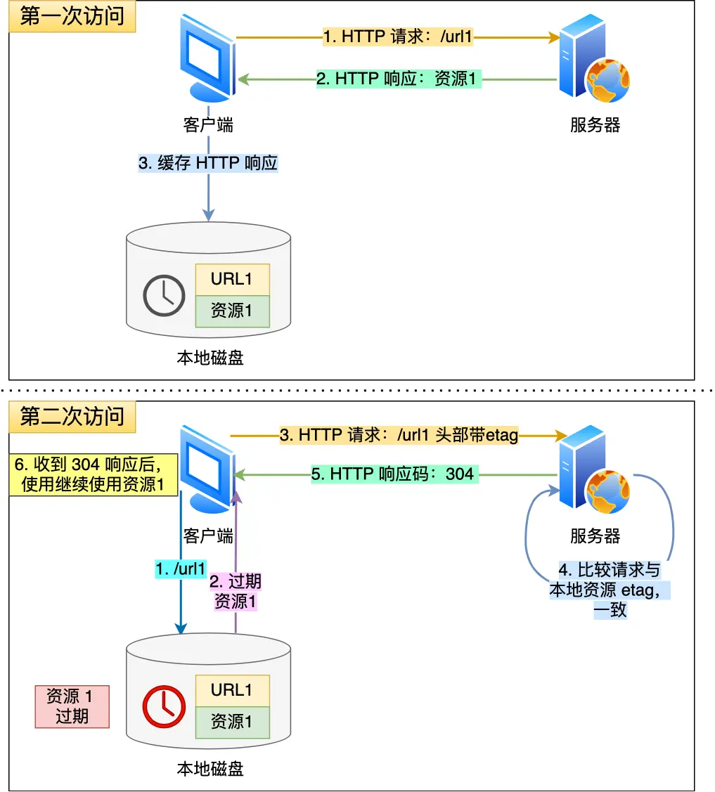

# HTTP

## HTTP

超文本传输协议（HyperText Transfer Protocol）

### HTTP 常见字段有哪些？ 

#### Host字段

客户端发起请求时，指定服务器域名

#### Content-Length字段

服务器返回数据时，会有Content-Length字段，表明本次回应的数据长度。

HTTP协议通过设置回车符、换行符作为HTTP header的边界，通过Content-Length字段作为HTTP body的边界，都是为了解决“粘包”的问题。

#### Connection字段

该字段最常用于客户端要求服务器使用 HTTP长连接 机制，以便其他请求复用。HTTP/1.1版本的默认连接都是长连接，但为了兼容老版本的HTTP，需要指定Connection首部字段的值为Keep-Alive

#### Connect-Type字段

该字段用于服务器回应时，告诉客户端，本次数据是什么格式。

客户端请求时，可以使用Accept字段声明自己可以接受哪些数据格式。

#### Connect-Encoding字段

该字段说明数据的压缩方法。

### HTTP缓存技术

HTTP缓存有两种实现方式，分别是强制缓存和协商缓存。

#### 强制缓存

只要浏览器判断缓存没有过期，则直接使用浏览器的本地缓存，决定是否使用缓存的主动性在于浏览器这边。

强缓存是利用HTTP相应头部的两个字段实现的。都是表示资源在客户端缓存的有效期：

* Cache-Control 是一个相对时间
* Expires 是一个绝对时间

两个同时存在的话，Cache-Control优先级更高。

#### 协商缓存

<figure><figcaption>
cache_etag
</figcaption></figure>

协商缓存都需要配合强制缓存中的Cache-Control字段来使用，只有在未能命中强制缓存的时候，才能发起带有协商缓存字段的请求。

### HTTP特性

到目前为止，HTTP常见的版本有HTTP/1.1、HTTP/2.0、HTTP/3.0，不同版本的特性不一样。

#### HTTP/1.1

#### 优点：简单、灵活和易于扩展、应用广泛和跨平台

缺点：无状态双刃剑、明文传输不安全（无状态双刃剑通过Cookie等方式解决。明文传输通过HTTPS方式解决）

性能：长连接、队头阻塞、管道网络传输（解决了请求的队头阻塞，没有解决相应的队头阻塞）

## HTTPS

* HTTPS在TCP和HTTP之间加了SSL/TLS协议，使得报文能够加密传输
* HTTP在TCP三次握手之后即可传输。HTTPS需要再TCP三次握手后加入SSL/TSL握手，才能传输
* HTTP默认端口80，HTTPS默认端口443
* HTTPS需要向CA申请数字证书

### 解决了HTTP哪些问题

窃听风险、篡改风险、冒充风险

#### 1. 混合加密

在通信建立前用非对称加密方式交换会话秘钥，后续不在使用非对称加密

通信过程中使用对称加密的会话秘钥方式加密明文数据

#### 2. 摘要算法+数字签名

为了保证传输内容不被篡改，对内容计算了一个指纹，然后和内容一起传输给对方。

对方收到后，先是对内容计算出一个指纹，然后跟对方发送的指纹做一个比较，如果指纹相同，说明内容没有被修改。这个指纹一般由哈希函数计算出来，不能逆推。**这样可以保证内容不被篡改，但不能保证内容加哈希值不被替换。**

通过非对称加密来确认身份。服务器通过私钥对哈希值加密生成数字签名，然后将内容，哈希值，数字签名发给客户端，客户端通过服务器公钥对数字签名进行解密得到哈希值，对比该哈希值和收到的哈希值就知道是否被篡改。由于其他人无服务器私钥，因此无法模仿数字签名。

#### 3. 数字证书

上面解决了消息完整性和内容篡改。但是缺少身份验证，如果公钥是伪造的呢？

因此有个权威机构CA，将服务器信息、服务器公钥及CA私钥对服务器公钥生成的数字证书打包成数字证书。只要证书可信，公钥就是可信的。

### HTTPS建立连接

SSL/TSL基本流程

* 客户端向服务器索要并验证服务器公钥
* 双方协商产生会话秘钥
* 双方采用会话秘钥进行加密通信

前两步就是TSL握手阶段，涉及四次通信。（不同的秘钥交换算法，握手流程也不一样。RSA算法握手如下：）

<figure><figcaption></figcaption></figure>

### HTTPS一定安全吗

HTTPS到目前为止没有任何漏洞，即使通过中间人攻击，本质上是利用了客户端漏洞（用户点击继续访问或者被恶意导入伪造的跟证书），并不是HTTPS不够安全
