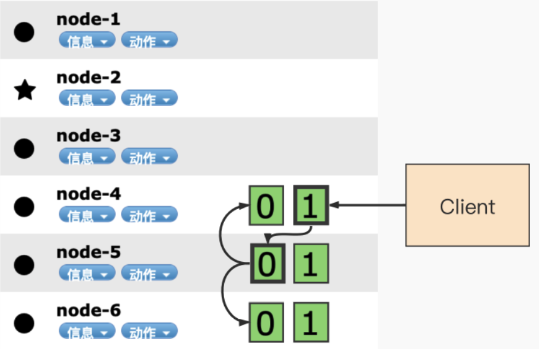
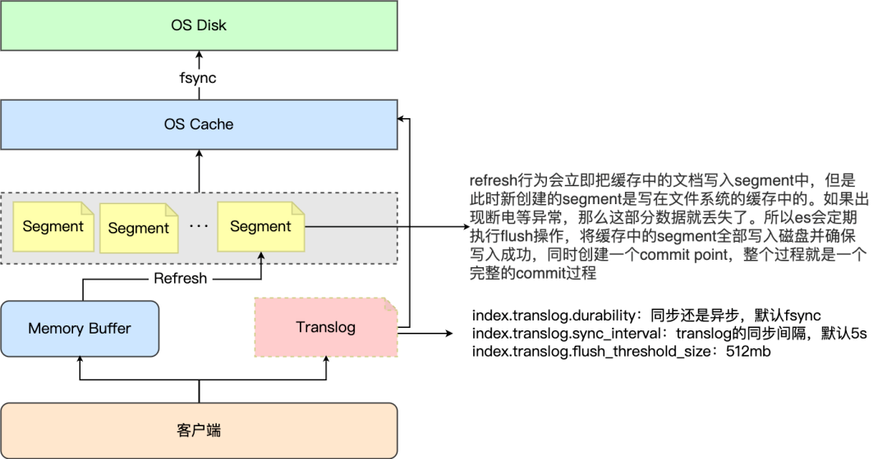

# Writing principle

## 写入过程

### ES支持四种对文档的数据写操作 <a href="#usercontent11es-zhi-chi-si-zhong-dui-wen-dang-de-shu-ju-xie-cao-zuo" id="usercontent11es-zhi-chi-si-zhong-dui-wen-dang-de-shu-ju-xie-cao-zuo"></a>

* create：如果在PUT数据的时候当前数据已经存在，则数据会被覆盖，如果在PUT的时候加上操作类型create，此时如果数据已存在则会返回失败，因为已经强制指定了操作类型为create，ES就不会再去执行update操作。比如：PUT /pruduct/\_create/1/ （ 老版本的语法为 PUT /pruduct/\_doc/1/\_create ）指的就是在索引product中强制创建id为1的数据，如果id为1的数据已存在，则返回失败。
* delete：删除文档，ES对文档的删除是懒删除机制，即标记删除。
* index：在ES中，写入操作被称为Index，这里Index为动词，即索引数据为将数据创建在ES中的索引，后面章节中均称之为“索引数据”。
* update：执行partial update（全量替换，部分替换）

### 写流程

ES中的数据写入均发生在Primary Shard，当数据在Primary写入完成之后会同步到相应的Replica Shard。下图演示了单条数据写入ES的流程

<figure><figcaption><p>es单条数据写入流程</p></figcaption></figure>

以下为数据写入的步骤：

1. 客户端发起写入请求至node 4
2. node 4通过文档 id 在路由表中的映射信息确定当前数据的位置为分片0，分片0的主分片位于node 5，并将数据转发至node 5。
3. 数据在node 5写入，写入成功之后将数据的同步请求转发至其副本所在的node 4和node 6上面，等待所有副本数据写入成功之后node 5将结果报告node 4，并由node 4将结果返回给客户端，报告数据写入成功。

在这个过程中，接收用户请求的节点是不固定的，上述例子中，node 4 发挥了协调节点和客户端节点的作用，将数据转发至对应节点和接收以及返回用户请求。

数据在由 node4 转发至 node5的时候，是通过以下公式来计算，指定的文档具体在那个分片的

```
shard_num = hash(_routing) % num_primary_shards
```

其中，\_routing 的默认值是文档的 id。

### 写一致性策略

ES 5.x 之后，一致性策略由 `wait_for_active_shards` 参数控制：

即确定客户端返回数据之前必须处于active 的分片分片数（包括主分片和副本），默认为 wait\_for\_active\_shards = 1，即只需要主分片写入成功，设置为 `all`或任何正整数，最大值为索引中的分片总数 ( `number_of_replicas + 1` )。如果当前 active 状态的副本没有达到设定阈值，写操作必须等待并且重试，默认等待时间30秒，直到 active 状态的副本数量超过设定的阈值或者超时返回失败为止。

执行索引操作时，分配给执行索引操作的主分片可能不可用。造成这种情况的原因可能是主分片当前正在从网关恢复或正在进行重定位。默认情况下，索引操作将在主分片上等待最多 1 分钟，然后才会失败并返回错误。

## 写入原理

来自于官方文档


ES-making changes persistent


<figure><figcaption><p>writing principle</p></figcaption></figure>

### Translog <a href="#user-content-2-2-translog" id="user-content-2-2-translog"></a>

对索引的修改操作在会 Lucene 执行 commit 之后真正持久化到磁盘，这是过程是非常消耗资源的，因此不可能在每次索引操作或删除操作后执行。Lucene 提交的成本太高，无法对每个单独的更改执行，因此每个分片副本还将操作写入其 _事务日志_，也就是 _translog_ 。所有索引和删除操作在被内部 Lucene 索引处理之后但在它们被确认之前写入到 translog。如果发生崩溃，当分片恢复时，已确认但尚未包含在最后一次 Lucene 提交中的最近操作将从 translog 中恢复。

Elasticsearch Flush 是Lucene 执行 commit 并开始写入新的 translog 的过程。刷新是在后台自动执行的，以确保 translog 不会变得太大，这将导致在恢复期间重放其操作需要相当长的时间。手动执行刷新的能力也通过 API 公开，但是一般并不需要。

translog 中的数据仅在 translog 被执行 `fsync` 和 commit 时才会持久化到磁盘。如果发生硬件故障或操作系统崩溃或 JVM 崩溃或分片故障，自上次 translog 提交以来写入的任何数据都将丢失。

默认情况下，`index.translog.durability`设置为意味着 Elasticsearch 仅在 translog在主分片和每个副本上 `request` 成功编辑并提交后，才会向客户端报告索引、删除、更新或批量请求的成功。`fsync` 如果 `index.translog.durability` 设置为 `async` then Elasticsearch `fsync`并仅提交 translog `index.translog.sync_interval`，这意味着当节点恢复时，在崩溃之前执行的任何操作都可能丢失。

以下[可动态更新](https://www.elastic.co/guide/en/elasticsearch/reference/7.13/indices-update-settings.html)的每个索引设置控制 translog 的行为：

*   `index.translog.sync_interval`

    无论写入操作如何，translog 默认每隔 `5s` 被 `fsync` 写入磁盘并 commit 一次，不允许设置小于 100ms 的提交间隔。
*   `index.translog.durability`

    是否 `fsync`在每次索引、删除、更新或批量请求后提交事务日志。此设置接受以下参数：

    * `request`（默认）：`fsync`并在每次请求后提交。如果发生硬件故障，所有确认的写入都已经提交到磁盘。
    * `async`：fsync `并在后台提交每个` sync\_interval\`. 如果发生故障，自上次自动提交以来所有确认的写入都将被丢弃。
*   `index.translog.flush_threshold_size`

    translog 存储所有尚未安全保存在 Lucene 中的操作（即，不是 Lucene 提交点的一部分）。尽管这些操作可用于读取，但如果分片停止并必须恢复，则需要重播它们。此设置控制这些操作的最大总大小，以防止恢复时间过长。一旦达到最大大小，就会发生刷新，生成一个新的 Lucene 提交点。默认为 `512mb`.

### Refresh

#### 概念和原理 <a href="#usercontent231-gai-nian-he-yuan-li" id="usercontent231-gai-nian-he-yuan-li"></a>

内存索引缓冲区（图 1）中的文档被写入新段（图 2）。新段首先写入文件系统缓存（这个过程性能消耗很低），然后才刷新到磁盘（这个过程则代价很低）。但是，在文件进入缓存后，它可以像任何其他文件一样打开和读取。

<figure><figcaption><p>内存索引缓冲区——图1</p></figcaption></figure>

Lucene 允许写入和打开新的段，使它们包含的文档对搜索可见，而无需执行完整的提交。这是一个比提交到磁盘更轻松的过程，并且可以经常执行而不会降低性能。

<figure><figcaption><p>新段——图2</p></figcaption></figure>

在 Elasticsearch 中，这个写入和打开新段的过程称为 _刷新_ 。刷新使自上次刷新以来对索引执行的所有操作都可用于搜索。

#### 设置刷新间隔

`index.refresh_interval`：多久执行一次刷新操作，这使得对索引的最近更改对搜索可见。默认为 `1s`. 可以设置 `-1` 为禁用刷新。

并不是所有的情况都需要每秒刷新。比如 Elasticsearch 索引大量的日志文件，此时并不需要太高的写入实时性， 可以通过设置 `refresh_interval` ，增大刷新间隔来降低每个索引的刷新频率，从而降低因为实时性而带来的性能开销。进而提升检索效率。

```sh
POST <index_name>
{
  "settings": {
    "refresh_interval": "30s"
  }
}
```

#### **强制对索引刷新** <a href="#usercontent233-qiang-zhi-dui-suo-yin-shua-xin" id="usercontent233-qiang-zhi-dui-suo-yin-shua-xin"></a>

```sh
POST <target>/_refresh

GET <target>/_refresh

POST /_refresh

GET /_refresh
```

### Flush <a href="#user-content-2-4-flush" id="user-content-2-4-flush"></a>

刷新数据流或索引是确保当前仅存储在 Traslog 中的任何数据也永久存储在 Lucene 索引中的过程。重新启动时，Elasticsearch 会将所有未刷新的操作从事务日志重播到 Lucene 索引，以使其恢复到重新启动前的状态。Elasticsearch 会根据需要自动触发刷新，使用启发式算法来权衡未刷新事务日志的大小与执行每次刷新的成本。

一旦每个操作被刷新，它就会永久存储在 Lucene 索引中。这可能意味着不需要在事务日志中维护它的额外副本。事务日志由多个文件组成，称为 _generation_ ，一旦不再需要，Elasticsearch 将删除任何生成文件，从而释放磁盘空间。

也可以使用刷新 API 触发一个或多个索引的刷新，尽管用户很少需要直接调用此 API。如果您在索引某些文档后调用刷新 API，则成功响应表明 Elasticsearch 已刷新在调用刷新 API 之前索引的所有文档。

### Merge <a href="#user-content-2-5-merge" id="user-content-2-5-merge"></a>

由于自动刷新流程每秒会创建一个新的段 ，这样会导致短时间内的段数量暴增。而段数目太多会带来较大的麻烦。 每一个段都会消耗文件句柄、内存和cpu运行周期。更重要的是，每个搜索请求都必须轮流检查每个段；所以段越多，搜索也就越慢。

Elasticsearch通过在后台进行段合并来解决这个问题。小的段被合并到大的段，然后这些大的段再被合并到更大的段。

<figure><figcaption><p>合并段</p></figcaption></figure>

Elasticsearch 中的一个 shard 是一个 Lucene 索引，一个 Lucene 索引被分解成段。段是存储索引数据的索引中的内部存储元素，并且是不可变的。较小的段会定期合并到较大的段中，并删除较小的段

<figure><figcaption><p>合并并删除段</p></figcaption></figure>

合并大的段需要消耗大量的I/O和CPU资源，如果任其发展会影响搜索性能。Elasticsearch在默认情况下会对合并流程进行资源限制，所以搜索仍然 有足够的资源很好地执行。
