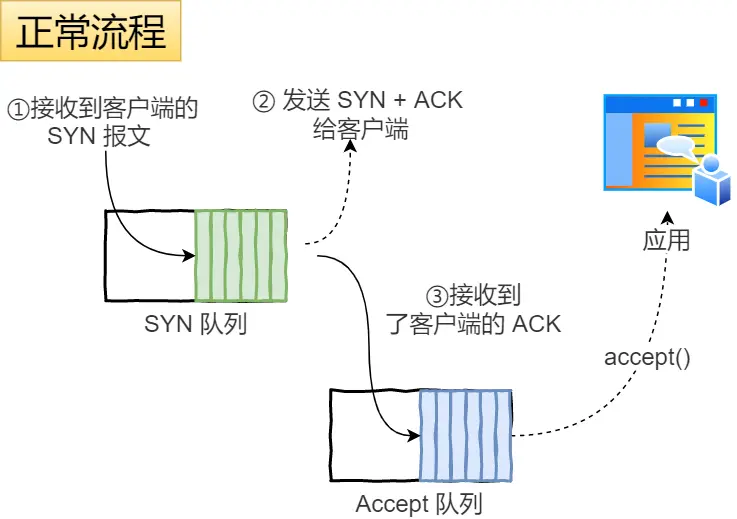

# TCP

## TCP报文

<figure><figcaption><p>tcp head</p></figcaption></figure>


## 三次握手

<figure><figcaption><p>Three-Way Handshake</p></figcaption></figure>

### 为什么不是两次

#### 1. 避免历史连接

为了防止旧的重复连接初始化造成混乱。

* 第一个请求连接如果网络拥堵，则会重发一个新的SYN请求连接，如果旧的比新的先到服务端并返回，客户端发现自己期望收到的不对，则会返回RST报文。RST比新SYN先到，则断掉旧的请求，正常连接新的请求
* 如果上面RST比新的SYN后到，此时新的SYN报文序列号乱序不对的情况，会回复一个携带正常的序列号和ACK报文。这个ACK被称为Challenge ACK。客户端收到后，发现不是自己期望的，会回RST报文，服务端收到，释放该连接。

上面旧的就是历史连接，使用三次握手就是为了防止历史连接初始化了连接

如果两次的话，就无法阻止历史连接。因为在两次握手，服务端没有中间态给客户端阻止历史连接，导致服务端可能会建立一个历史连接，导致资源浪费。

#### 2. 同步双方初始序列号

TCP通讯双方必须维护一个「序列号」

这个序列号可以让接受方去除重复数据；接收方根据序列号按序接收；可以标记发出去的数据包，哪些是对方已经收到的

三次握手一来一回，才能确保双方初始序列号能被可靠的同步；两次只能保证一方的初始化序列号被对方接收，不能保证双方的都被接收。

#### 3. 避免资源浪费

如果使用两次握手，则网络阻塞时，客户端重新发送SYN，服务端不清楚客户端是否收到确认ACK，因此会收到一个SYN就建立一个连接，这样会建立多个冗余无效连接，造成资源浪费。

### 为什么每次建立连接，初始化的序列号要求不一样

* 为了防止历史报文被下一个相同的四元组的连接接收
* 为了安全性，防止黑客伪造相同序列号的报文被对方接收

### SYN攻击

如果攻击者短时间伪造不同IP地址的SYN报文，服务端每接收一个，进入`SYN_RCVD`状态，但服务端发出去的`SYN+ACK`无法获得回应，则慢慢会占满服务端的半连接队列，使得无法服务正常用户。

TCP三次握手时，内核会维护两个队列

* 半连接队列，也称SYN队列
* 全连接队列，也成accept队列

正常工作流程如图：

<figure><figcaption><p>syn_accept_work</p></figcaption></figure>

不管全半连接队列，都有最大长度，超过限制则会丢弃报文。

#### 避免SYN攻击

1. 增大netdev\_max\_backlog
   1. 网卡接收速度大于内核处理速度时，会有队列保存这些数据包，控制该队列最大值
   2. 默认1000 `net.core.netdev_max_backlog`
2. 增大TCP半连接队列
   1. 同时增大三个参数
   2. `net.ipv4.tcp_max_syn_backlog`  `listen()函数的backlog`  `net.core.somaxconn`
3. 开启net.ipv4.tcp\_syncookies
   1. 可以在不使用SYN半连接队列的情况下成功建立连接
4. 减少SYN+ACK重传次数
   1. 由内核参数 tcp\_synack\_retries 内核参数决定，默认5次

## 四次挥手

<figure><figcaption><p>Four-Way Handshake</p></figcaption></figure>

每个方向都要一个FIN和一个ACK

### 为什么需要四次

服务端通常需要等待完成数据的发送和处理，所以服务端的ACK和FIN一般都会分开发送，因此需要四次挥手。

#### 四次挥手可以变成三次吗？

**可以**，在一些情况，四次挥手是可以变成三次的。

被动关闭方在TCP挥手过程中，「没有数据要发送」并且「开启了TCP延迟确认机制」，那么第二和第三次挥手就会合并传输，就出现了三次挥手。这个延迟确认机制是默认开启的，因此抓包时看到的三次挥手比四次挥手还多。

### 为什么需要TIME\_WAIT状态

只有主动发起管理连接的一方，才会有该状态

#### 1. 防止历史连接中的数据，被后面相同四元组的连接错误的接收

TCP设计了TIME\_WAIT状态，维持2MSL时长，这个时间可以让两个方向上的数据包都被丢弃，使得原来连接的数据包在网络中都自然消失，再出现的数据包一定都是新建立连接所产生的。

#### 2. 保证「被动关闭」的一方，能正确关闭

等待足够的时间，确保最后的ACK能让被动关闭放接收，从而帮助其正常关闭。

假设没有该状态，发完最后一次ACK，直接CLOSE，如果该ACK丢失的话，服务端重传FIN，客户端已经关闭，则会返回RST报文，这样对于服务端来说是一个错误。不是一个优雅的终止方式。

### 为什么TIME\_WAIT等待时间2MSL

MSL是 Maximum Segment Lifetime 报文最大生存时间。它是任何报文在网络上存在的最大时长，超过这个时间报文将被丢弃。

TIME\_WAIT等待2倍MSL，比较合理的解释是：网络中可能存在来自发送方的数据包，这些发送方的数据包被接收方处理后又会向对方发送响应，一来一回需要等待2倍时间。其实相当于至少允许报文丢失一次。

### TIME\_WAIT问题排查

#### 过多的危害

* 占用系统资源，如文件描述符、内存、CPU、线程等
* 占用端口资源

如果客户端的TIME\_WAIT过多，占满了所有端口资源，则无法对「目的IP+目的PORT」都一样的服务端发器连接，但是被使用的端口可以对另一个服务器发起连接。

如果服务端的TIME\_WAIT过多，不会导致端口资源受限，一个四元组确定一个TCP连接，因此理论上服务端可以建立狠毒哟连接，但是TCP连接过多，会占用系统资源等

#### 如何优化TIME\_WAIT

1. [**打开net.ipv4.tcp\_tw\_reuse和tcp\_timestamps**](#user-content-fn-1)[^1]
2. [**net.ipv4.tcp\_max\_tw\_bucket**](#user-content-fn-2)[^2]
3. [**程序中使用SO\_LINGER**](#user-content-fn-3)[^3]

基本都是通过跨越TIME\_WAIT状态，这样不太好，它的设计就是为了避免发生其他事情。

### 服务器出现大量TIME\_WAIT状态

说明服务器主动断开了很多TCP连接

#### 1. HTTP没有使用长连接

虽然没有规定在短连接的情况下，谁来关TCP连接。但根据大多数WEB服务实现，不管哪一方禁用HTTP Keep-Alive，都是由服务端主动关闭连接，这样就会出现TIME\_WAIT状态

* 客户端禁用，服务端没禁。发起端为客户端，服务端作为末端 关闭连接很合理
* 服务端禁用，客户端没禁。服务端关闭连接，这样只需要调用一次close()就可以；否则需要把socket放入readable队列，调用epoll等待事件，在调用read()才能知道连接关闭，这样需要两次系统调用。

#### 2. HTTP长连接超时

长连接特点是，只要任意一端没有明确提出端口，则保持TCP连接。

因此为了避免资源浪费，web服务软件都会有一个参数来指定长连接超时事件，比如nginx提供的keepalive\_timeout参数。（如果客户端完成一个http请求后，在这个时间内都没有发新的请求，nginx则会触发回调函数关闭该连接）

可以排查网络问题，是否因为网络问题，导致客户端发送的数据一直没有被服务端收到。

#### 3. HTTP长连接的请求数量达到上限

web服务端一般会有一个参数，定义一条长连接上最大能处理的请求数量，超过后，就会主动关闭连接。

比如nginx的keepalive\_requests参数，代表建立长连接后，客户端请求数量达到这个值，nginx则会主动关闭这个长连接。（默认100）

### 服务器出现大量CLOSE\_WAIT状态

被动关闭方才有该状态。说明服务端没有调用close()函数关闭连接

* 新连接到时没有调用accept函数获取socket
* 通过accept获取socket后，没有注册到epoll，导致后续收到FIN报文的时候，没法感知事件
* 发现客户端关闭连接后，没有执行close函数

## TCP保活机制

如果已经建立连接，但是客户端发生故障了怎么办。客户端故障指的是客户端主机宕机或者断电的情况，如果服务端一直不发送数据给客户端，则服务端永远不知道客户端的情况，则该TCP连接一直占用服务器系统资源。

为了避免该情况，TCP做了个保活机制

```sh
net.ipv4.tcp_keepalive_time=7200 # 如果2小时没有任何连接活动，启动保活机制
net.ipv4.tcp_keepalive_intvl=75  # 每次探测时间间隔75s
net.ipv4.tcp_keepalive_probes=9  # 探测9次无响应，关闭连接
```

也就是说在Linux中，要经历2小时11分15秒才能发现一个死亡连接。

注意：应用程序如果想使用TCP保活机制需要通过socket接口设置SO\_KEEPALIVE选项才能生效。

TCP保活开启后的几种情况：

1. 对面正常。探测报文发给对方，对方正常响应，则保活时间重置，等待下一次
2. 对端宕机并重启。对面收到，由于没有有效信息，会返回RST报文
3. 对端宕机（不是进程崩溃，进程崩溃时，操作系统回收资源时，会发送FIN报文）。石沉大海

一般这个探测时间比较长，因此大多数web都支持http长连接超时事件，可以使用应用层的心跳机制。

## TCP重传次数

如果另一端宕机或断电断网，这一端发送了数据，由于没有收到ACK，则会一直重传，达到阈值后，则会判断该TCP有问题，则会主动断开。

Llnux系统中，有一个叫tcp\_retries2的配置项，默认值是15

[^1]: 开启后，可以复用处于TIME\_WAIT的socket为新的连接所用。

    tcp\_tw\_reuse功能只能在客户端（连接发起方），因为开启该功能，在调用connect()是，内核会随机找一个TIME\_WAIT状态超过1秒的连接给新的连接复用。（使用该选项，前提是打开对TCP时间戳的支持）

[^2]: 默认18000，当系统中处于TIME\_WAIT的连接一旦超过这个值，将会将后面的TIME\_WAIT连接状态重置

[^3]: 设置socket选项，设置调用close关闭连接行为。调用close后，直接发送RST标志给对端，直接跳过挥手。不建议如此操作。
