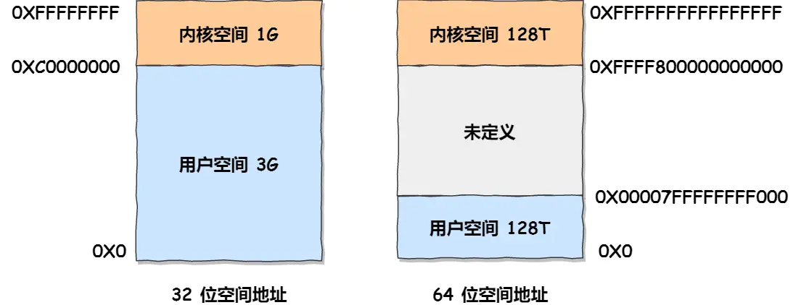
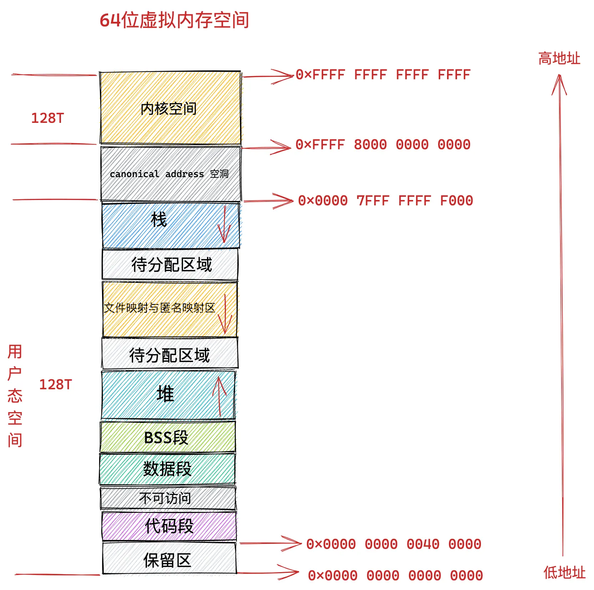

# Virtual Memory

## 虚拟内存

单片机是没有操作系统，写完代码之后需要使用工具将程序录进去，程序才能跑起来，且单片机是直接操作内存的物理地址。

这样，想在内存中同时运行两个程序是不可能的。如果第一个程序在 2000 的位置写入一个新的值，将会擦掉第二个程序存放在相同位置上的所有内容，所以同时运行两个程序是根本行不通的，这两个程序会立刻崩溃。

所有操作系统为每个进程分配独立的一套「虚拟内存」，每个进程都不能访问物理地址，虚拟地址如何落到无力内存，对进程来说是透明的，操作系统进行安排。

**操作系统会提供一种机制，将不同进程的虚拟地址和不同内存的物理地址映射起来。**

如果程序要访问虚拟地址的时候，由操作系统转换成不同的物理地址，这样不同的进程运行的时候，写入的是不同的物理地址，这样就不会冲突了。

于是，这里就引出了两种地址的概念：

* 我们程序所使用的内存地址叫做**虚拟内存地址**（_Virtual Memory Address_）
* 实际存在硬件里面的空间地址叫**物理内存地址**（_Physical Memory Address_）

操作系统引入了虚拟内存，进程持有的虚拟地址会通过 CPU 芯片中的内存管理单元（MMU）的映射关系，来转换变成物理地址，然后再通过物理地址访问内存

> 操作系统是如何管理虚拟地址与物理地址之间的关系？

主要有两种方式，分别是**内存分段和内存分页**，分段是比较早提出的，我们先来看看内存分段。

### 内存分段

程序是由若干个逻辑分段组成的，如可由代码分段、数据分段、栈段、堆段组成。**不同的段是有不同的属性的，所以就用分段（**_**Segmentation**_**）的形式把这些段分离出来。**

> 分段机制下，虚拟地址和物理地址是如何映射的？

分段机制下的虚拟地址由两部分组成，**段选择因子**和**段内偏移量**。

<figure><figcaption><p>memory_segment</p></figcaption></figure>

段选择因子和段内偏移量：

* **段选择因子**就保存在段寄存器里面。段选择因子里面最重要的是**段号**，用作段表的索引。**段表**里面保存的是这个**段的基地址、段的界限和特权等级**等。
* 虚拟地址中的**段内偏移量**应该位于 0 和段界限之间，如果段内偏移量是合法的，就将段基地址加上段内偏移量得到物理内存地址。

在上面，知道了虚拟地址是通过**段表**与物理地址进行映射的，分段机制会把程序的虚拟地址分成 4 个段，每个段在段表中有一个项，在这一项找到段的基地址，再加上偏移量，于是就能找到物理内存中的地址，

<figure><figcaption><p>memory_segment_address</p></figcaption></figure>

分段的办法很好，解决了程序本身不需要关心具体的物理内存地址的问题，但它也有一些不足之处：

* 第一个就是**内存碎片**的问题。
* 第二个就是**内存交换的效率低**的问题。

#### 内存碎片

* 物理内存碎片，段回收出现不连续物理内存
* 内存分段出现内存碎片（内存碎片主要分为，内部内存碎片和外部内存碎片）
  * 内存分段管理可以做到段根据实际需求分配内存，所以有多少需求就分配多大的段，所以**不会出现内部内存碎片**。
  * 但是由于每个段的长度不固定，所以多个段未必能恰好使用所有的内存空间，会产生了多个不连续的小物理内存，导致新的程序无法被装载，所以**会出现外部内存碎片**的问题。

#### 内存交换

解决「外部内存碎片」的问题就是**内存交换**。内存交换空间，在 Linux 系统里，也就是我们常看到的 Swap 空间，这块空间是从硬盘划分出来的，用于内存与硬盘的空间交换。

对于多进程的系统来说，用分段的方式，外部内存碎片是很容易产生的，产生了外部内存碎片，那不得不重新 `Swap` 内存区域，这个过程会产生性能瓶颈。

因为硬盘的访问速度要比内存慢太多了，每一次内存交换，我们都需要把一大段连续的内存数据写到硬盘上。

所以，**如果内存交换的时候，交换的是一个占内存空间很大的程序，这样整个机器都会显得卡顿。**

为了解决内存分段的「外部内存碎片和内存交换效率低」的问题，就出现了内存分页。

### 内存分页

**分页是把整个虚拟和物理内存空间切成一段段固定尺寸的大小**。这样一个连续并且尺寸固定的内存空间，我们叫**页**（_Page_）。在 Linux 下，每一页的大小为 `4KB`。

虚拟地址与物理地址之间通过**页表**来映射

<figure><figcaption><p>memory_page</p></figcaption></figure>

页表是存储在内存里的，**内存管理单元** （_MMU_）就做将虚拟内存地址转换成物理地址的工作。

而当进程访问的虚拟地址在页表中查不到时，系统会产生一个**缺页异常**，进入系统内核空间分配物理内存、更新进程页表，最后再返回用户空间，恢复进程的运行。

#### 分页是怎么解决分段的「外部内存碎片和内存交换效率低」的问题？

* 内存分页由于内存空间都是预先划分好的，也就不会像内存分段一样，在段与段之间会产生间隙非常小的内存，这正是分段会产生外部内存碎片的原因。而**采用了分页，页与页之间是紧密排列的，所以不会有外部碎片。**
* 但是，因为内存分页机制分配内存的最小单位是一页，即使程序不足一页大小，我们最少只能分配一个页，所以页内会出现内存浪费，所以针对**内存分页机制会有内部内存碎片**的现象。

如果内存空间不够，操作系统会把其他正在运行的进程中的「最近没被使用」的内存页面给释放掉，也就是暂时写在硬盘上，称为**换出**（_Swap Out_）。一旦需要的时候，再加载进来，称为**换入**（_Swap In_）。所以，一次性写入磁盘的也只有少数的一个页或者几个页，不会花太多时间，**内存交换的效率就相对比较高。**

<figure><figcaption><p>memory_page_swap</p></figcaption></figure>

更进一步地，分页的方式使得我们在加载程序的时候，不再需要一次性都把程序加载到物理内存中。我们完全可以在进行虚拟内存和物理内存的页之间的映射之后，并不真的把页加载到物理内存里，而是**只有在程序运行中，需要用到对应虚拟内存页里面的指令和数据时，再加载到物理内存里面去。**

#### 分页机制下，虚拟地址和物理地址是如何映射的？

在分页机制下，虚拟地址分为两部分，**页号**和**页内偏移**。页号作为页表的索引，**页表**包含物理页每页所在**物理内存的基地址**，这个基地址与页内偏移的组合就形成了物理内存地址

<figure><figcaption><p>memery_page_reflect</p></figcaption></figure>

对于一个内存地址转换，其实就是这样三个步骤：

* 把虚拟内存地址，切分成页号和偏移量；
* 根据页号，从页表里面，查询对应的物理页号；
* 直接拿物理页号，加上前面的偏移量，就得到了物理内存地址。

#### 简单的分页有什么缺陷吗？

有空间上的缺陷。

因为操作系统是可以同时运行非常多的进程的，那这不就意味着页表会非常的庞大。

在 32 位的环境下，虚拟地址空间共有 4GB，假设一个页的大小是 4KB（2^12），那么就需要大约 100 万 （2^20） 个页，每个「页表项」需要 4 个字节大小来存储，那么整个 4GB 空间的映射就需要有 `4MB` 的内存来存储页表。

这 4MB 大小的页表，看起来也不是很大。但是要知道每个进程都是有自己的虚拟地址空间的，也就说都有自己的页表。

那么，`100` 个进程的话，就需要 `400MB` 的内存来存储页表，这是非常大的内存了，更别说 64 位的环境了。

#### 多级页表

要解决上面的问题，就需要采用一种叫作**多级页表**（_Multi-Level Page Table_）的解决方案。

对于单页表的实现方式，在 32 位和页大小 `4KB` 的环境下，一个进程的页表需要装下 100 多万个「页表项」，于是相当于每个页表需占用 4MB 大小的空间。把这个 100 多万个「页表项」的单级页表再分页，将页表（一级页表）分为 `1024` 个页表（二级页表），每个表（二级页表）中包含 `1024` 个「页表项」，形成**二级分页**。如下图所示：

<figure><figcaption><p>memory_page_multilevel</p></figcaption></figure>

如果 4GB 的虚拟地址全部都映射到了物理内存上的话，二级分页占用空间确实是更大了，但是，我们往往不会为一个进程分配那么多内存。

每个进程都有 4GB 的虚拟地址空间，而显然对于大多数程序来说，其使用到的空间远未达到 4GB，因为会存在部分对应的页表项都是空的，根本没有分配，对于已分配的页表项，如果存在最近一定时间未访问的页表，在物理内存紧张的情况下，操作系统会将页面换出到硬盘，也就是说不会占用物理内存。

如果使用了二级分页，一级页表就可以覆盖整个 4GB 虚拟地址空间，但**如果某个一级页表的页表项没有被用到，也就不需要创建这个页表项对应的二级页表了，即可以在需要时才创建二级页表**。做个简单的计算，假设只有 20% 的一级页表项被用到了，那么页表占用的内存空间就只有 4KB（一级页表） + 20% \* 4MB（二级页表）= `0.804MB`，这对比单级页表的 `4MB` 是不是一个巨大的节约？

那么为什么不分级的页表就做不到这样节约内存呢？

我们从页表的性质来看，保存在内存中的页表承担的职责是将虚拟地址翻译成物理地址。假如虚拟地址在页表中找不到对应的页表项，计算机系统就不能工作了。所以**页表一定要覆盖全部虚拟地址空间，不分级的页表就需要有 100 多万个页表项来映射，而二级分页则只需要 1024 个页表项**（此时一级页表覆盖到了全部虚拟地址空间，二级页表在需要时创建）。

我们把二级分页再推广到多级页表，就会发现页表占用的内存空间更少了，这一切都要归功于对局部性原理的充分应用。

对于 64 位的系统，两级分页肯定不够了，就变成了四级目录，分别是：

* 全局页目录项 PGD（_Page Global Directory_）；
* 上层页目录项 PUD（_Page Upper Directory_）；
* 中间页目录项 PMD（_Page Middle Directory_）；
* 页表项 PTE（_Page Table Entry_）；

<figure><figcaption><p>64_memory_page_multilevel</p></figcaption></figure>

#### TLB <a href="#tlb" id="tlb"></a>

多级页表虽然解决了空间上的问题，但是虚拟地址到物理地址的转换就多了几道转换的工序，这显然就降低了这俩地址转换的速度，也就是带来了时间上的开销。

程序是有局部性的，即在一段时间内，整个程序的执行仅限于程序中的某一部分。相应地，执行所访问的存储空间也局限于某个内存区域。

我们就可以利用这一特性，把最常访问的几个页表项存储到访问速度更快的硬件，于是计算机科学家们，就在 CPU 芯片中，加入了一个专门存放程序最常访问的页表项的 Cache，这个 Cache 就是 TLB（_Translation Lookaside Buffer_） ，通常称为页表缓存、转址旁路缓存、快表等。

<figure><figcaption><p>memory_page_tlb</p></figcaption></figure>

在 CPU 芯片里面，封装了内存管理单元（_Memory Management Unit_）芯片，它用来完成地址转换和 TLB 的访问与交互。

有了 TLB 后，那么 CPU 在寻址时，会先查 TLB，如果没找到，才会继续查常规的页表。

TLB 的命中率其实是很高的，因为程序最常访问的页就那么几个。

### 段页式内存管理

内存分段和内存分页并不是对立的，它们是可以组合起来在同一个系统中使用的，那么组合起来后，通常称为**段页式内存管理**。

段页式内存管理实现的方式：

* 先将程序划分为多个有逻辑意义的段，也就是前面提到的分段机制；
* 接着再把每个段划分为多个页，也就是对分段划分出来的连续空间，再划分固定大小的页；

这样，地址结构就由**段号、段内页号和页内位移**三部分组成。

用于段页式地址变换的数据结构是每一个程序一张段表，每个段又建立一张页表，段表中的地址是页表的起始地址，而页表中的地址则为某页的物理页号，如图所示：

<figure><figcaption><p>memory_segmentpage_mgr</p></figcaption></figure>

段页式地址变换中要得到物理地址须经过三次内存访问：

* 第一次访问段表，得到页表起始地址；
* 第二次访问页表，得到物理页号；
* 第三次将物理页号与页内位移组合，得到物理地址。

可用软、硬件相结合的方法实现段页式地址变换，这样虽然增加了硬件成本和系统开销，但提高了内存的利用率。

### Linux内存布局

早期的intel处理器使用的段式内存管理，但是光有段式内存管理而没有页式内存管理是不够的。后续的intel处理在页式内存管理设计时，没有绕开段式内存管理，而是建立在段式内存管理的基础上，这就意味着，**页式内存管理的作用是在由段式内存管理所映射而成的地址上再加上一层地址映射**

段式内存管理先将逻辑地址映射成线性地址，然后再由页式内存管理将线性地址映射成物理地址。

* 程序所使用的地址，通常是没被段式内存管理映射的地址，称为逻辑地址；
* 通过段式内存管理映射的地址，称为线性地址，也叫虚拟地址；

#### Linux使用

**Linux 内存主要采用的是页式内存管理，但同时也不可避免地涉及了段机制**。

**Linux 系统中的每个段都是从 0 地址开始的整个 4GB 虚拟空间（32 位环境下），也就是所有的段的起始地址都是一样的。这意味着，Linux 系统中的代码，包括操作系统本身的代码和应用程序代码，所面对的地址空间都是线性地址空间（虚拟地址），这种做法相当于屏蔽了处理器中的逻辑地址概念，段只被用于访问控制和内存保护。**

在 Linux 操作系统中，虚拟地址空间的内部又被分为**内核空间和用户空间**两部分，不同位数的系统，地址空间的范围也不同。比如最常见的 32 位和 64 位系统

<figure><figcaption><p>memory_linux_virtual_memory</p></figcaption></figure>

虽然每个进程都各自有独立的虚拟内存，但是**每个虚拟内存中的内核地址，其实关联的都是相同的物理内存**。这样，进程切换到内核态后，就可以很方便地访问内核空间内存。

<figure><figcaption><p>memory_linux_process_space</p></figcaption></figure>

## Linux虚拟内存管理

### &#x20;Linux 进程虚拟内存空间 <a href="#id-4linux-jin-cheng-xu-ni-nei-cun-kong-jian" id="id-4linux-jin-cheng-xu-ni-nei-cun-kong-jian"></a>

#### 32 位机器上进程虚拟内存空间分布 <a href="#id-4132-wei-ji-qi-shang-jin-cheng-xu-ni-nei-cun-kong-jian-fen-bu" id="id-4132-wei-ji-qi-shang-jin-cheng-xu-ni-nei-cun-kong-jian-fen-bu"></a>

在 32 位机器上，指针的寻址范围为 2^32，所能表达的虚拟内存空间为 4 GB。所以在 32 位机器上进程的虚拟内存地址范围为：0x0000 0000 - 0xFFFF FFFF。

其中用户态虚拟内存空间为 3 GB，虚拟内存地址范围为：0x0000 0000 - 0xC000 000 。

内核态虚拟内存空间为 1 GB，虚拟内存地址范围为：0xC000 000 - 0xFFFF FFFF

<figure><figcaption><p>32_virtual_space</p></figcaption></figure>

但是用户态虚拟内存空间中的代码段并不是从 0x0000 0000 地址开始的，而是从 0x0804 8000 地址开始。

0x0000 0000 到 0x0804 8000 这段虚拟内存地址是一段不可访问的保留区，因为在大多数操作系统中，数值比较小的地址通常被认为不是一个合法的地址，这块小地址是不允许访问的。比如在 C 语言中我们通常会将一些无效的指针设置为 NULL，指向这块不允许访问的地址。

堆空间的上边是一段待分配区域，用于扩展堆空间的使用。

文件映射与匿名映射区域。进程运行时所依赖的动态链接库中的代码段，数据段，BSS 段就加载在这里。还有我们调用 mmap 映射出来的一段虚拟内存空间也保存在这个区域。**注意：在文件映射与匿名映射区的地址增长方向是从高地址向低地址增长**。

栈空间了，在这里会保存函数运行过程所需要的局部变量以及函数参数等函数调用信息。**栈空间中的地址增长方向是从高地址向低地址增长**。每次进程申请新的栈地址时，其地址值是在减少的。在内核中使用 start\_stack 标识栈的起始位置，RSP 寄存器中保存栈顶指针 stack pointer，RBP 寄存器中保存的是栈基地址。

#### 64 位机器上进程虚拟内存空间分布 <a href="#id-4264-wei-ji-qi-shang-jin-cheng-xu-ni-nei-cun-kong-jian-fen-bu" id="id-4264-wei-ji-qi-shang-jin-cheng-xu-ni-nei-cun-kong-jian-fen-bu"></a>

32 位机器上，指针的寻址范围为 2^32，所能表达的虚拟内存空间为 4 GB。

事实上在目前的 64 位系统下只使用了 48 位来描述虚拟内存空间，寻址范围为 2^48 ，所能表达的虚拟内存空间为 256TB。

其中低 128 T 表示用户态虚拟内存空间，虚拟内存地址范围为：0x0000 0000 0000 0000 - 0x0000 7FFF FFFF F000 。

高 128 T 表示内核态虚拟内存空间，虚拟内存地址范围为：0xFFFF 8000 0000 0000 - 0xFFFF FFFF FFFF FFFF 。

这样一来就在用户态虚拟内存空间与内核态虚拟内存空间之间形成了一段 0x0000 7FFF FFFF F000 - 0xFFFF 8000 0000 0000 的地址空洞，我们把这个空洞叫做 canonical address 空洞。

<figure><figcaption><p>64_virtual_space</p></figcaption></figure>

&#x20;64 位系统中的虚拟内存布局和 32 位系统中的虚拟内存布局大体上是差不多的。主要不同的地方有三点：

1. 就是前边提到的由高 16 位空闲地址造成的 canonical address 空洞。在这段范围内的虚拟内存地址是不合法的，因为它的高 16 位既不全为 0 也不全为 1，不是一个 canonical address，所以称之为 canonical address 空洞。
2. 在代码段跟数据段的中间还有一段不可以读写的保护段，它的作用是防止程序在读写数据段的时候越界访问到代码段，这个保护段可以让越界访问行为直接崩溃，防止它继续往下运行。
3. 用户态虚拟内存空间与内核态虚拟内存空间分别占用 128T，其中低128T 分配给用户态虚拟内存空间，高 128T 分配给内核态虚拟内存空间。

### 进程虚拟内存管理

无论是在 32 位机器上还是在 64 位机器上，进程虚拟内存空间的核心区域分布的相对位置是不变的，它们都包含下图所示的这几个核心内存区域。唯一不同的是这些核心内存区域在 32 位机器和 64 位机器上的绝对位置分布会有所不同。

<figure><figcaption><p>process_core_memory</p></figcaption></figure>

内核如何为进程管理这些虚拟内存区域呢？

进程在内核中的描述符 task\_struct 结构

```c
struct task_struct {
        // 进程id
	    pid_t				pid;
        // 用于标识线程所属的进程 pid
	    pid_t				tgid;
        // 进程打开的文件信息
        struct files_struct		*files;
        // 内存描述符表示进程虚拟地址空间
        struct mm_struct		*mm;

        .......... 省略 .......
}
```

在进程描述符 task\_struct 结构中，有一个专门描述进程虚拟地址空间的内存描述符 mm\_struct 结构，这个结构体中包含了进程虚拟内存空间的全部信息。

每个进程都有唯一的 mm\_struct 结构体，也就是每个进程的虚拟地址空间都是独立，互不干扰的。

当我们调用 fork() 函数创建进程的时候，表示进程地址空间的 mm\_struct 结构会随着进程描述符 task\_struct 的创建而创建。

```c
long _do_fork(unsigned long clone_flags,
	      unsigned long stack_start,
	      unsigned long stack_size,
	      int __user *parent_tidptr,
	      int __user *child_tidptr,
	      unsigned long tls)
{
        ......... 省略 ..........
	struct pid *pid;
	struct task_struct *p;

        ......... 省略 ..........
    // 为进程创建 task_struct 结构，用父进程的资源填充 task_struct 信息
	p = copy_process(clone_flags, stack_start, stack_size,
			 child_tidptr, NULL, trace, tls, NUMA_NO_NODE);

         ......... 省略 ..........
}
```

随后会在 copy\_process 函数中创建 task\_struct 结构，并拷贝父进程的相关资源到新进程的 task\_struct 结构里，其中就包括拷贝父进程的虚拟内存空间 mm\_struct 结构。**这里可以看出子进程在新创建出来之后它的虚拟内存空间是和父进程的虚拟内存空间一模一样的，直接拷贝过来**。

```c
static __latent_entropy struct task_struct *copy_process(
					unsigned long clone_flags,
					unsigned long stack_start,
					unsigned long stack_size,
					int __user *child_tidptr,
					struct pid *pid,
					int trace,
					unsigned long tls,
					int node)
{

    struct task_struct *p;
    // 创建 task_struct 结构
    p = dup_task_struct(current, node);

        ....... 初始化子进程 ...........

        ....... 开始继承拷贝父进程资源  .......      
    // 继承父进程打开的文件描述符
	retval = copy_files(clone_flags, p);
    // 继承父进程所属的文件系统
	retval = copy_fs(clone_flags, p);
    // 继承父进程注册的信号以及信号处理函数
	retval = copy_sighand(clone_flags, p);
	retval = copy_signal(clone_flags, p);
    // 继承父进程的虚拟内存空间
	retval = copy_mm(clone_flags, p);
    // 继承父进程的 namespaces
	retval = copy_namespaces(clone_flags, p);
    // 继承父进程的 IO 信息
	retval = copy_io(clone_flags, p);

      ...........省略.........
    // 分配 CPU
    retval = sched_fork(clone_flags, p);
    // 分配 pid
    pid = alloc_pid(p->nsproxy->pid_ns_for_children);

.     ..........省略.........
}
```

这里我们重点关注 copy\_mm 函数，正是在这里完成了子进程虚拟内存空间 mm\_struct 结构的的创建以及初始化。

```c
static int copy_mm(unsigned long clone_flags, struct task_struct *tsk)
{
    // 子进程虚拟内存空间，父进程虚拟内存空间
	struct mm_struct *mm, *oldmm;
	int retval;

        ...... 省略 ......

	tsk->mm = NULL;
	tsk->active_mm = NULL;
    // 获取父进程虚拟内存空间
	oldmm = current->mm;
	if (!oldmm)
		return 0;

        ...... 省略 ......
    // 通过 vfork 或者 clone 系统调用创建出的子进程（线程）和父进程共享虚拟内存空间
	if (clone_flags & CLONE_VM) {
        // 增加父进程虚拟地址空间的引用计数
		mmget(oldmm);
        // 直接将父进程的虚拟内存空间赋值给子进程（线程）
        // 线程共享其所属进程的虚拟内存空间
		mm = oldmm;
		goto good_mm;
	}

	retval = -ENOMEM;
    // 如果是 fork 系统调用创建出的子进程，则将父进程的虚拟内存空间以及相关页表拷贝到子进程中的 mm_struct 结构中。
	mm = dup_mm(tsk);
	if (!mm)
		goto fail_nomem;

good_mm:
    // 将拷贝出来的父进程虚拟内存空间 mm_struct 赋值给子进程
	tsk->mm = mm;
	tsk->active_mm = mm;
	return 0;

        ...... 省略 ......
```

由于本小节中我们举的示例是通过 fork() 函数创建子进程的情形，所以这里先占时忽略 `if (clone_flags & CLONE_VM)` 这个条件判断逻辑，我们先跳过往后看\~\~

copy\_mm 函数首先会将父进程的虚拟内存空间 current->mm 赋值给指针 oldmm。然后通过 dup\_mm 函数将父进程的虚拟内存空间以及**相关页表**拷贝到子进程的 mm\_struct 结构中。最后将拷贝出来的 mm\_struct 赋值给子进程的 task\_struct 结构。

> 通过 fork() 函数创建出的子进程，它的虚拟内存空间以及相关页表相当于父进程虚拟内存空间的一份拷贝，直接从父进程中拷贝到子进程中。

而当我们通过 vfork 或者 clone 系统调用创建出的子进程，首先会设置 CLONE\_VM 标识，这样来到 copy\_mm 函数中就会进入 `if (clone_flags & CLONE_VM)` 条件中，在这个分支中会将父进程的虚拟内存空间以及相关页表直接赋值给子进程。这样一来父进程和子进程的虚拟内存空间就变成共享的了。也就是说父子进程之间使用的虚拟内存空间是一样的，并不是一份拷贝。

子进程共享了父进程的虚拟内存空间，这样子进程就变成了我们熟悉的线程，**是否共享地址空间几乎是进程和线程之间的本质区别。Linux 内核并不区别对待它们，线程对于内核来说仅仅是一个共享特定资源的进程而已**。

内核线程和用户态线程的区别就是内核线程没有相关的内存描述符 mm\_struct ，内核线程对应的 task\_struct 结构中的 mm 域指向 Null，所以内核线程之间调度是不涉及地址空间切换的。

当一个内核线程被调度时，它会发现自己的虚拟地址空间为 Null，虽然它不会访问用户态的内存，但是它会访问内核内存，聪明的内核会将调度之前的上一个用户态进程的虚拟内存空间 mm\_struct 直接赋值给内核线程，因为内核线程不会访问用户空间的内存，它仅仅只会访问内核空间的内存，所以直接复用上一个用户态进程的虚拟地址空间就可以避免为内核线程分配 mm\_struct 和相关页表的开销，以及避免内核线程之间调度时地址空间的切换开销。

> 父进程与子进程的区别，进程与线程的区别，以及内核线程与用户态线程的区别其实都是围绕着这个 mm\_struct 展开的。

#### 内核如何划分用户态和内核态虚拟内存空间 <a href="#id-51-nei-he-ru-he-hua-fen-yong-hu-tai-he-nei-he-tai-xu-ni-nei-cun-kong-jian" id="id-51-nei-he-ru-he-hua-fen-yong-hu-tai-he-nei-he-tai-xu-ni-nei-cun-kong-jian"></a>

进程的内存描述符 mm\_struct 结构体中的 task\_size 变量，task\_size 定义了用户态地址空间与内核态地址空间之间的分界线。

```c
struct mm_struct {
    unsigned long task_size;	/* size of task vm space */
}
```

32 位系统中用户地址空间和内核地址空间的分界线在 0xC000 000 地址处，那么自然进程的 mm\_struct 结构中的 task\_size 为 0xC000 000。

64 位系统中用户地址空间和内核地址空间的分界线在 0x0000 7FFF FFFF F000 地址处，那么自然进程的 mm\_struct 结构中的 task\_size 为 0x0000 7FFF FFFF F000 。

#### 内核如何管理虚拟内存区域 <a href="#id-53-nei-he-ru-he-guan-li-xu-ni-nei-cun-qu-yu" id="id-53-nei-he-ru-he-guan-li-xu-ni-nei-cun-qu-yu"></a>

结构体 vm\_area\_struct，这个结构体描述了这些虚拟内存区域 VMA（virtual memory area）。

```c
struct vm_area_struct {

	unsigned long vm_start;		/* Our start address within vm_mm. */
	unsigned long vm_end;		/* The first byte after our end address
					   within vm_mm. */
	/*
	 * Access permissions of this VMA.
	 */
	pgprot_t vm_page_prot;
	unsigned long vm_flags;	

	struct anon_vma *anon_vma;	/* Serialized by page_table_lock */
    struct file * vm_file;		/* File we map to (can be NULL). */
	unsigned long vm_pgoff;		/* Offset (within vm_file) in PAGE_SIZE
					   units */	
	void * vm_private_data;		/* was vm_pte (shared mem) */
	/* Function pointers to deal with this struct. */
	const struct vm_operations_struct *vm_ops;
}
```

每个 vm\_area\_struct 结构对应于虚拟内存空间中的唯一虚拟内存区域 VMA，vm\_start 指向了这块虚拟内存区域的起始地址（最低地址），vm\_start 本身包含在这块虚拟内存区域内。vm\_end 指向了这块虚拟内存区域的结束地址（最高地址），而 vm\_end 本身包含在这块虚拟内存区域之外，所以 vm\_area\_struct 结构描述的是 \[vm\_start，vm\_end) 这样一段左闭右开的虚拟内存区域。

<figure><figcaption><p>space_core_mgr</p></figcaption></figure>

### 程序编译后的二进制文件如何映射到虚拟内存空间中 <a href="#id-6-cheng-xu-bian-yi-hou-de-er-jin-zhi-wen-jian-ru-he-ying-she-dao-xu-ni-nei-cun-kong-jian-zhong" id="id-6-cheng-xu-bian-yi-hou-de-er-jin-zhi-wen-jian-ru-he-ying-she-dao-xu-ni-nei-cun-kong-jian-zhong"></a>

我们写的程序代码编译之后会生成一个 ELF 格式的二进制文件，这个二进制文件中包含了程序运行时所需要的元信息，比如程序的机器码，程序中的全局变量以及静态变量等。

这个 ELF 格式的二进制文件中的布局和我们前边讲的虚拟内存空间中的布局类似，也是一段一段的，每一段包含了不同的元数据。

> 磁盘文件中的段我们叫做 Section，内存中的段我们叫做 Segment，也就是内存区域。

磁盘文件中的这些 Section 会在进程运行之前加载到内存中并映射到内存中的 Segment。通常是多个 Section 映射到一个 Segment。

那么这些 ELF 格式的二进制文件中的 Section 是如何加载并映射进虚拟内存空间的呢？

内核中完成这个映射过程的函数是 load\_elf\_binary ，这个函数的作用很大，加载内核的是它，启动第一个用户态进程 init 的是它，fork 完了以后，调用 exec 运行一个二进制程序的也是它。当 exec 运行一个二进制程序的时候，除了解析 ELF 的格式之外，另外一个重要的事情就是建立上述提到的内存映射。

```c
static int load_elf_binary(struct linux_binprm *bprm)
{
      ...... 省略 ........
  // 设置虚拟内存空间中的内存映射区域起始地址 mmap_base
  setup_new_exec(bprm);

     ...... 省略 ........
  // 创建并初始化栈对应的 vm_area_struct 结构。
  // 设置 mm->start_stack 就是栈的起始地址也就是栈底，并将 mm->arg_start 是指向栈底的。
  retval = setup_arg_pages(bprm, randomize_stack_top(STACK_TOP),
         executable_stack);

     ...... 省略 ........
  // 将二进制文件中的代码部分映射到虚拟内存空间中
  error = elf_map(bprm->file, load_bias + vaddr, elf_ppnt,
        elf_prot, elf_flags, total_size);

     ...... 省略 ........
 // 创建并初始化堆对应的的 vm_area_struct 结构
 // 设置 current->mm->start_brk = current->mm->brk，设置堆的起始地址 start_brk，结束地址 brk。 起初两者相等表示堆是空的
  retval = set_brk(elf_bss, elf_brk, bss_prot);

     ...... 省略 ........
  // 将进程依赖的动态链接库 .so 文件映射到虚拟内存空间中的内存映射区域
  elf_entry = load_elf_interp(&loc->interp_elf_ex,
              interpreter,
              &interp_map_addr,
              load_bias, interp_elf_phdata);

     ...... 省略 ........
  // 初始化内存描述符 mm_struct
  current->mm->end_code = end_code;
  current->mm->start_code = start_code;
  current->mm->start_data = start_data;
  current->mm->end_data = end_data;
  current->mm->start_stack = bprm->p;

     ...... 省略 ........
}
```

* setup\_new\_exec 设置虚拟内存空间中的内存映射区域起始地址 mmap\_base
* setup\_arg\_pages 创建并初始化栈对应的 vm\_area\_struct 结构。置 mm->start\_stack 就是栈的起始地址也就是栈底，并将 mm->arg\_start 是指向栈底的。
* elf\_map 将 ELF 格式的二进制文件中.text ，.data，.bss 部分映射到虚拟内存空间中的代码段，数据段，BSS 段中。
* set\_brk 创建并初始化堆对应的的 vm\_area\_struct 结构，设置 `current->mm->start_brk = current->mm->brk`，设置堆的起始地址 start\_brk，结束地址 brk。 起初两者相等表示堆是空的。
* load\_elf\_interp 将进程依赖的动态链接库 .so 文件映射到虚拟内存空间中的内存映射区域
* 初始化内存描述符 mm\_struct

### 内核虚拟内存空间 <a href="#id-7-nei-he-xu-ni-nei-cun-kong-jian" id="id-7-nei-he-xu-ni-nei-cun-kong-jian"></a>

不同进程之间的虚拟内存空间是相互隔离的，彼此之间相互独立，相互感知不到其他进程的存在。使得进程以为自己拥有所有的内存资源。而内核态虚拟内存空间是所有进程共享的，不同进程进入内核态之后看到的虚拟内存空间全部是一样的。
