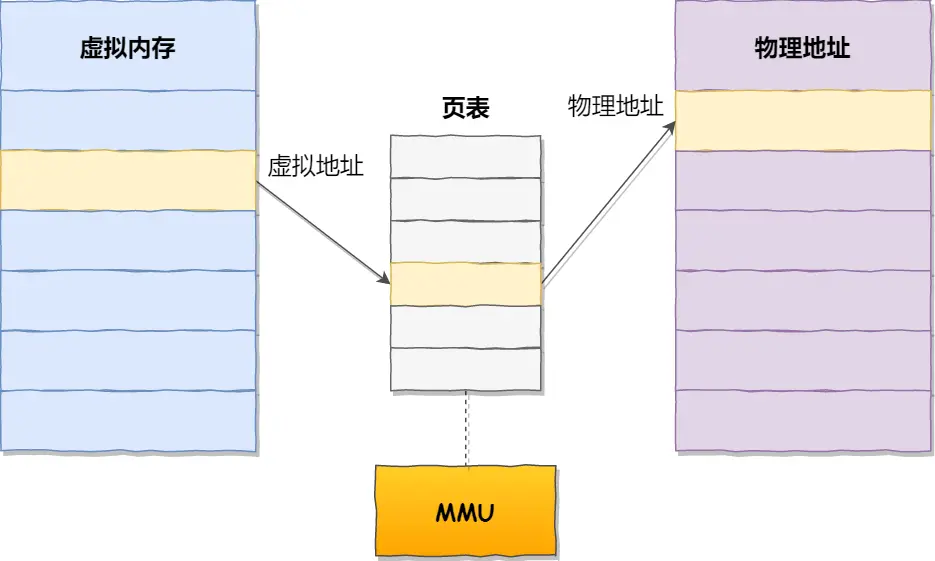

# Virtual Memory

## 虚拟内存

单片机是没有操作系统，写完代码之后需要使用工具将程序录进去，程序才能跑起来，且单片机是直接操作内存的物理地址。

这样，想在内存中同时运行两个程序是不可能的。如果第一个程序在 2000 的位置写入一个新的值，将会擦掉第二个程序存放在相同位置上的所有内容，所以同时运行两个程序是根本行不通的，这两个程序会立刻崩溃。

所有操作系统为每个进程分配独立的一套「虚拟内存」，每个进程都不能访问物理地址，虚拟地址如何落到无力内存，对进程来说是透明的，操作系统进行安排。

**操作系统会提供一种机制，将不同进程的虚拟地址和不同内存的物理地址映射起来。**

如果程序要访问虚拟地址的时候，由操作系统转换成不同的物理地址，这样不同的进程运行的时候，写入的是不同的物理地址，这样就不会冲突了。

于是，这里就引出了两种地址的概念：

* 我们程序所使用的内存地址叫做**虚拟内存地址**（_Virtual Memory Address_）
* 实际存在硬件里面的空间地址叫**物理内存地址**（_Physical Memory Address_）

操作系统引入了虚拟内存，进程持有的虚拟地址会通过 CPU 芯片中的内存管理单元（MMU）的映射关系，来转换变成物理地址，然后再通过物理地址访问内存

> 操作系统是如何管理虚拟地址与物理地址之间的关系？

主要有两种方式，分别是**内存分段和内存分页**，分段是比较早提出的，我们先来看看内存分段。

### 内存分段

程序是由若干个逻辑分段组成的，如可由代码分段、数据分段、栈段、堆段组成。**不同的段是有不同的属性的，所以就用分段（**_**Segmentation**_**）的形式把这些段分离出来。**

> 分段机制下，虚拟地址和物理地址是如何映射的？

分段机制下的虚拟地址由两部分组成，**段选择因子**和**段内偏移量**。

<figure><figcaption>
memory_segmentation
</figcaption></figure>

段选择因子和段内偏移量：

* **段选择因子**就保存在段寄存器里面。段选择因子里面最重要的是**段号**，用作段表的索引。**段表**里面保存的是这个**段的基地址、段的界限和特权等级**等。
* 虚拟地址中的**段内偏移量**应该位于 0 和段界限之间，如果段内偏移量是合法的，就将段基地址加上段内偏移量得到物理内存地址。

在上面，知道了虚拟地址是通过**段表**与物理地址进行映射的，分段机制会把程序的虚拟地址分成 4 个段，每个段在段表中有一个项，在这一项找到段的基地址，再加上偏移量，于是就能找到物理内存中的地址，

<figure><figcaption>
memory_segment_address
</figcaption></figure>

分段的办法很好，解决了程序本身不需要关心具体的物理内存地址的问题，但它也有一些不足之处：

* 第一个就是**内存碎片**的问题。
* 第二个就是**内存交换的效率低**的问题。

#### 内存碎片

* 物理内存碎片，段回收出现不连续物理内存
* 内存分段出现内存碎片（内存碎片主要分为，内部内存碎片和外部内存碎片）
  * 内存分段管理可以做到段根据实际需求分配内存，所以有多少需求就分配多大的段，所以**不会出现内部内存碎片**。
  * 但是由于每个段的长度不固定，所以多个段未必能恰好使用所有的内存空间，会产生了多个不连续的小物理内存，导致新的程序无法被装载，所以**会出现外部内存碎片**的问题。

#### 内存交换

解决「外部内存碎片」的问题就是**内存交换**。内存交换空间，在 Linux 系统里，也就是我们常看到的 Swap 空间，这块空间是从硬盘划分出来的，用于内存与硬盘的空间交换。

对于多进程的系统来说，用分段的方式，外部内存碎片是很容易产生的，产生了外部内存碎片，那不得不重新 `Swap` 内存区域，这个过程会产生性能瓶颈。

因为硬盘的访问速度要比内存慢太多了，每一次内存交换，我们都需要把一大段连续的内存数据写到硬盘上。

所以，**如果内存交换的时候，交换的是一个占内存空间很大的程序，这样整个机器都会显得卡顿。**

为了解决内存分段的「外部内存碎片和内存交换效率低」的问题，就出现了内存分页。

### 内存分页

**分页是把整个虚拟和物理内存空间切成一段段固定尺寸的大小**。这样一个连续并且尺寸固定的内存空间，我们叫**页**（_Page_）。在 Linux 下，每一页的大小为 `4KB`。

虚拟地址与物理地址之间通过**页表**来映射

<figure><figcaption>
memory_page
</figcaption></figure>

页表是存储在内存里的，**内存管理单元** （_MMU_）就做将虚拟内存地址转换成物理地址的工作。

而当进程访问的虚拟地址在页表中查不到时，系统会产生一个**缺页异常**，进入系统内核空间分配物理内存、更新进程页表，最后再返回用户空间，恢复进程的运行。
