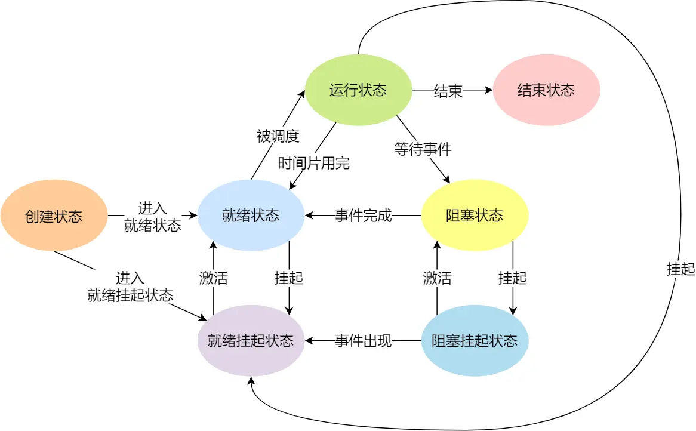
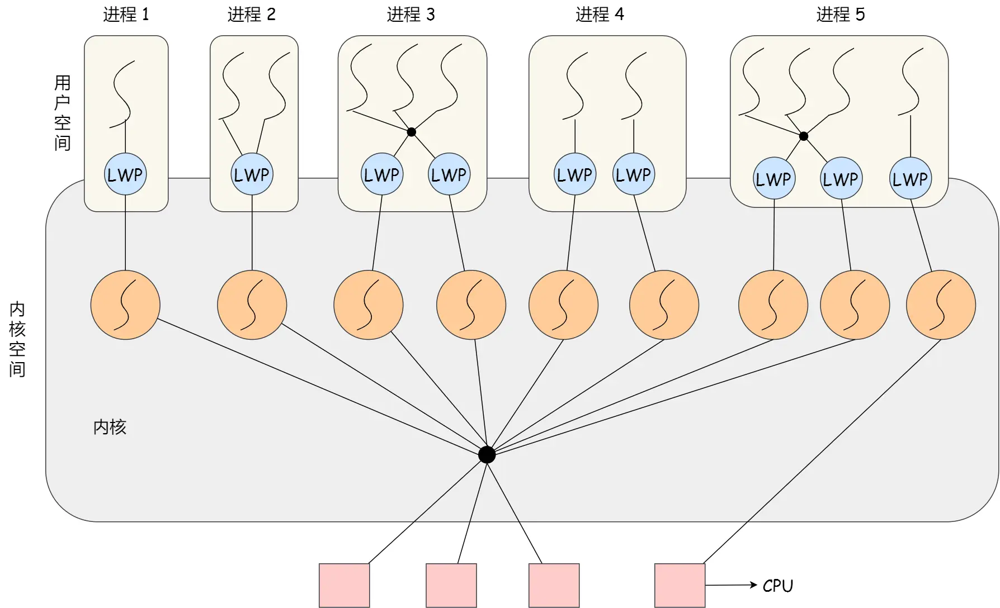

# Process Thread

## 进程

我们编写的代码只是一个存储在硬盘的静态文件，通过编译后就会生成二进制可执行文件，当我们运行这个可执行文件后，它会被装载到内存中，接着 CPU 会执行程序中的每一条指令，那么这个**运行中的程序，就被称为「进程」（Process）**。

### 进程的状态

<figure><figcaption><p>process_status</p></figcaption></figure>

### 进程的控制结构

在操作系统中，是用**进程控制块**（_process control block，PCB_）数据结构来描述进程的。

<mark style="color:blue;">**PCB 是进程存在的唯一标识**</mark><mark style="color:blue;">，</mark>这意味着一个进程的存在，必然会有一个 PCB，如果进程消失了，那么 PCB 也会随之消失。

PCB 具体包含信息

* **进程描述信息：**
  * 进程标识符：标识各个进程，每个进程都有一个并且唯一的标识符；
  * 用户标识符：进程归属的用户，用户标识符主要为共享和保护服务；
* **进程控制和管理信息：**
  * 进程当前状态，如 new、ready、running、waiting 或 blocked 等；
  * 进程优先级：进程抢占 CPU 时的优先级；
* **资源分配清单：**
  * 有关内存地址空间或虚拟地址空间的信息，所打开文件的列表和所使用的 I/O 设备信息。
* **CPU 相关信息：**
  * CPU 中各个寄存器的值，当进程被切换时，CPU 的状态信息都会被保存在相应的 PCB 中，以便进程重新执行时，能从断点处继续执行。

PCB通常是通过**链表**的方式进行组织，把具有**相同状态的进程链在一起，组成各种队列**。

### 进程的控制

进程的**创建、终止、阻塞、唤醒**的过程，这些过程也就是进程的控制。

#### &#x20;**创建进程**

操作系统允许一个进程创建另一个进程，而且允许子进程继承父进程所拥有的资源。

创建进程的过程如下：

* 申请一个空白的 PCB，并向 PCB 中填写一些控制和管理进程的信息，比如进程的唯一标识等；
* 为该进程分配运行时所必需的资源，比如内存资源；
* 将 PCB 插入到就绪队列，等待被调度运行；

#### **终止进程**

进程可以有 3 种终止方式：正常结束、异常结束以及外界干预（信号 `kill` 掉）。

当子进程被终止时，其在父进程处继承的资源应当还给父进程。而当父进程被终止时，该父进程的子进程就变为孤儿进程，会被 1 号进程收养，并由 1 号进程对它们完成状态收集工作。

终止进程的过程如下：

* 查找需要终止的进程的 PCB；
* 如果处于执行状态，则立即终止该进程的执行，然后将 CPU 资源分配给其他进程；
* 如果其还有子进程，则应将该进程的子进程交给 1 号进程接管；
* 将该进程所拥有的全部资源都归还给操作系统；
* 将其从 PCB 所在队列中删除；

#### **阻塞进程**

当进程需要等待某一事件完成时，它可以调用阻塞语句把自己阻塞等待。而一旦被阻塞等待，它只能由另一个进程唤醒。

阻塞进程的过程如下：

* 找到将要被阻塞进程标识号对应的 PCB；
* 如果该进程为运行状态，则保护其现场，将其状态转为阻塞状态，停止运行；
* 将该 PCB 插入到阻塞队列中去；

#### **唤醒进程**

进程由「运行」转变为「阻塞」状态是由于进程必须等待某一事件的完成，所以处于阻塞状态的进程是绝对不可能叫醒自己的。

如果某进程正在等待 I/O 事件，需由别的进程发消息给它，则只有当该进程所期待的事件出现时，才由发现者进程用唤醒语句叫醒它。

唤醒进程的过程如下：

* 在该事件的阻塞队列中找到相应进程的 PCB；
* 将其从阻塞队列中移出，并置其状态为就绪状态；
* 把该 PCB 插入到就绪队列中，等待调度程序调度；

进程的阻塞和唤醒是一对功能相反的语句，如果某个进程调用了阻塞语句，则必有一个与之对应的唤醒语句。

### 进程上下文切换

各个进程之间是共享 CPU 资源的，在不同的时候进程之间需要切换，让不同的进程可以在 CPU 执行，那么这个<mark style="color:blue;">**一个进程切换到另一个进程运行，称为进程的上下文切换**</mark><mark style="color:blue;">。</mark>

#### CPU上下文切换

任务是交给 CPU 运行的，那么在每个任务运行前，CPU 需要知道任务从哪里加载，又从哪里开始运行。所以，操作系统需要事先帮 CPU 设置好 **CPU 寄存器和程序计数器**。

所以说，CPU 寄存器和程序计数是 CPU 在运行任何任务前，所必须依赖的环境，这些环境就叫做 **CPU 上下文**。

CPU 上下文切换就是先把前一个任务的 CPU 上下文（CPU 寄存器和程序计数器）保存起来，然后加载新任务的上下文到这些寄存器和程序计数器，最后再跳转到程序计数器所指的新位置，运行新任务。系统内核会存储保持下来的上下文信息，当此任务再次被分配给 CPU 运行时，CPU 会重新加载这些上下文，这样就能保证任务原来的状态不受影响，让任务看起来还是连续运行。

上面说到所谓的「任务」，主要包含进程、线程和中断。所以，可以根据任务的不同，把 CPU 上下文切换分成：**进程上下文切换、线程上下文切换和中断上下文切换**。

#### 进程上下文切换

进程是由内核管理和调度的，所以进程的切换只能发生在内核态。

所以，**进程的上下文切换不仅包含了虚拟内存、栈、全局变量等用户空间的资源，还包括了内核堆栈、寄存器等内核空间的资源。**

通常，会把交换的信息保存在进程的 PCB，当要运行另外一个进程的时候，我们需要从这个进程的 PCB 取出上下文，然后恢复到 CPU 中，这使得这个进程可以继续执行。

<mark style="color:red;">**注意：**</mark>进程的上下文开销是很关键的，我们希望它的开销越小越好，这样可以使得进程可以把更多时间花费在执行程序上，而不是耗费在上下文切换。

#### 进程上下文切换场景

* 为了保证所有进程可以得到公平调度，CPU 时间被划分为一段段的时间片，这些时间片再被轮流分配给各个进程。这样，当某个进程的时间片耗尽了，进程就从运行状态变为就绪状态，系统从就绪队列选择另外一个进程运行；
* 进程在系统资源不足（比如内存不足）时，要等到资源满足后才可以运行，这个时候进程也会被挂起，并由系统调度其他进程运行；
* 当进程通过睡眠函数 sleep 这样的方法将自己主动挂起时，自然也会重新调度；
* 当有优先级更高的进程运行时，为了保证高优先级进程的运行，当前进程会被挂起，由高优先级进程来运行；
* 发生硬件中断时，CPU 上的进程会被中断挂起，转而执行内核中的中断服务程序；

## 线程

**线程是进程当中的一条执行流程。**

同一个进程内多个线程之间可以共享代码段、数据段、打开的文件等资源，但每个线程各自都有一套独立的寄存器和栈，这样可以确保线程的控制流是相对独立的。

### 线程优缺点

线程的优点：

* 一个进程中可以同时存在多个线程；
* 各个线程之间可以并发执行；
* 各个线程之间可以共享地址空间和文件等资源；

线程的缺点：

* 当进程中的一个线程崩溃时，会导致其所属进程的所有线程崩溃（这里是针对 C/C++ 语言，Java语言中的线程奔溃不会造成进程崩溃，具体分析原因可以看这篇：[线程崩溃了，进程也会崩溃吗？ (opens new window)](https://xiaolincoding.com/os/4\_process/thread\_crash.html)）。

举个例子，对于游戏的用户设计，则不应该使用多线程的方式，否则一个用户挂了，会影响其他同个进程的线程。

### 线程与进程的比较 <a href="#xian-cheng-yu-jin-cheng-de-bi-jiao" id="xian-cheng-yu-jin-cheng-de-bi-jiao"></a>

* 进程是资源（包括内存、打开的文件等）分配的单位，线程是 CPU 调度的单位；
* 进程拥有一个完整的资源平台，而线程只独享必不可少的资源，如寄存器和栈；
* 线程同样具有就绪、阻塞、执行三种基本状态，同样具有状态之间的转换关系；
* 线程能减少并发执行的时间和空间开销；

对于，线程相比进程能减少开销，体现在：

* 线程的创建时间比进程快，因为进程在创建的过程中，还需要资源管理信息，比如内存管理信息、文件管理信息，而线程在创建的过程中，不会涉及这些资源管理信息，而是共享它们；
* 线程的终止时间比进程快，因为线程释放的资源相比进程少很多；
* 同一个进程内的线程切换比进程切换快，因为线程具有相同的地址空间（虚拟内存共享），这意味着同一个进程的线程都具有同一个页表，那么在切换的时候不需要切换页表。而对于进程之间的切换，切换的时候要把页表给切换掉，而页表的切换过程开销是比较大的；
* 由于同一进程的各线程间共享内存和文件资源，那么在线程之间数据传递的时候，就不需要经过内核了，这就使得线程之间的数据交互效率更高了；

所以，不管是时间效率，还是空间效率线程比进程都要高。

### 线程的上下文切换 <a href="#xian-cheng-de-shang-xia-wen-qie-huan" id="xian-cheng-de-shang-xia-wen-qie-huan"></a>

线程与进程最大的区别在于：**线程是调度的基本单位，而进程则是资源拥有的基本单位**。

所以，所谓操作系统的任务调度，实际上的调度对象是线程，而进程只是给线程提供了虚拟内存、全局变量等资源。

对于线程和进程，我们可以这么理解：

* 当进程只有一个线程时，可以认为进程就等于线程；
* 当进程拥有多个线程时，这些线程会共享相同的虚拟内存和全局变量等资源，这些资源在上下文切换时是不需要修改的；

另外，线程也有自己的私有数据，比如栈和寄存器等，这些在上下文切换时也是需要保存的。

> 线程上下文切换的是什么？

这还得看线程是不是属于同一个进程：

* 当两个线程不是属于同一个进程，则切换的过程就跟进程上下文切换一样；
* **当两个线程是属于同一个进程，因为虚拟内存是共享的，所以在切换时，虚拟内存这些资源就保持不动，只需要切换线程的私有数据、寄存器等不共享的数据**；

所以，线程的上下文切换相比进程，开销要小很多。

### 线程的实现 <a href="#xian-cheng-de-shi-xian" id="xian-cheng-de-shi-xian"></a>

主要有三种线程的实现方式：

* **用户线程（**_**User Thread**_**）**：在用户空间实现的线程，不是由内核管理的线程，是由用户态的线程库来完成线程的管理；
* **内核线程（**_**Kernel Thread**_**）**：在内核中实现的线程，是由内核管理的线程；
* **轻量级进程（**_**LightWeight Process**_**）**：在内核中来支持用户线程；

那么，这还需要考虑一个问题，用户线程和内核线程的对应关系。

* 第一种关系是**多对一**的关系，也就是多个用户线程对应同一个内核线程：
* 第二种是**一对一**的关系，也就是一个用户线程对应一个内核线程
* 第三种是**多对多**的关系，也就是多个用户线程对应到多个内核线程

#### 用户线程

用户线程是基于用户态的线程管理库来实现的，那么**线程控制块（**_**Thread Control Block, TCB**_**）** 也是在库里面来实现的，对于操作系统而言是看不到这个 TCB 的，它只能看到整个进程的 PCB。

所以，**用户线程的整个线程管理和调度，操作系统是不直接参与的，而是由用户级线程库函数来完成线程的管理，包括线程的创建、终止、同步和调度等。**

用户线程的**优点**：

* 每个进程都需要有它私有的线程控制块（TCB）列表，用来跟踪记录它各个线程状态信息（PC、栈指针、寄存器），TCB 由用户级线程库函数来维护，可用于不支持线程技术的操作系统；
* 用户线程的切换也是由线程库函数来完成的，无需用户态与内核态的切换，所以速度特别快；

用户线程的**缺点**：

* 由于操作系统不参与线程的调度，如果一个线程发起了系统调用而阻塞，那进程所包含的用户线程都不能执行了。
* 当一个线程开始运行后，除非它主动地交出 CPU 的使用权，否则它所在的进程当中的其他线程无法运行，因为用户态的线程没法打断当前运行中的线程，它没有这个特权，只有操作系统才有，但是用户线程不是由操作系统管理的。
* 由于时间片分配给进程，故与其他进程比，在多线程执行时，每个线程得到的时间片较少，执行会比较慢；

#### 内核线程

**内核线程是由操作系统管理的，线程对应的 TCB 自然是放在操作系统里的，这样线程的创建、终止和管理都是由操作系统负责。**

内核线程的模型，也就类似前面提到的**一对一**的关系，即一个用户线程对应一个内核线程

内核线程的**优点**：

* 在一个进程当中，如果某个内核线程发起系统调用而被阻塞，并不会影响其他内核线程的运行；
* 分配给线程，多线程的进程获得更多的 CPU 运行时间；

内核线程的**缺点**：

* 在支持内核线程的操作系统中，由内核来维护进程和线程的上下文信息，如 PCB 和 TCB；
* 线程的创建、终止和切换都是通过系统调用的方式来进行，因此对于系统来说，系统开销比较大；

#### 轻量级线程

**轻量级进程（**_**Light-weight process，LWP**_**）是内核支持的用户线程，一个进程可有一个或多个 LWP，每个 LWP 是跟内核线程一对一映射的，也就是 LWP 都是由一个内核线程支持，而且 LWP 是由内核管理并像普通进程一样被调度**。

在大多数系统中，**LWP与普通进程的区别也在于它只有一个最小的执行上下文和调度程序所需的统计信息**。一般来说，一个进程代表程序的一个实例，而 LWP 代表程序的执行线程，因为一个执行线程不像进程那样需要那么多状态信息，所以 LWP 也不带有这样的信息。

在 LWP 之上也是可以使用用户线程的，那么 LWP 与用户线程的对应关系就有三种：

* `1 : 1`，即一个 LWP 对应 一个用户线程；
* `N : 1`，即一个 LWP 对应多个用户线程；
* `M : N`，即多个 LWP 对应多个用户线程；

<figure><figcaption><p>thread_lwp_model</p></figcaption></figure>

**1 : 1 模式**

一个线程对应到一个 LWP 再对应到一个内核线程，如上图的进程 4，属于此模型。

* 优点：实现并行，当一个 LWP 阻塞，不会影响其他 LWP；
* 缺点：每一个用户线程，就产生一个内核线程，创建线程的开销较大。

**N : 1 模式**

多个用户线程对应一个 LWP 再对应一个内核线程，如上图的进程 2，线程管理是在用户空间完成的，此模式中用户的线程对操作系统不可见。

* 优点：用户线程要开几个都没问题，且上下文切换发生用户空间，切换的效率较高；
* 缺点：一个用户线程如果阻塞了，则整个进程都将会阻塞，另外在多核 CPU 中，是没办法充分利用 CPU 的。

**M : N 模式**

根据前面的两个模型混搭一起，就形成 `M:N` 模型，该模型提供了两级控制，首先多个用户线程对应到多个 LWP，LWP 再一一对应到内核线程，如上图的进程 3。

* 优点：综合了前两种优点，大部分的线程上下文发生在用户空间，且多个线程又可以充分利用多核 CPU 的资源。

**组合模式**

如上图的进程 5，此进程结合 `1:1` 模型和 `M:N` 模型。开发人员可以针对不同的应用特点调节内核线程的数目来达到物理并行性和逻辑并行性的最佳方案。

## 调度

进程都希望自己能够占用 CPU 进行工作，那么这涉及到前面说过的进程上下文切换。

一旦操作系统把进程切换到运行状态，也就意味着该进程占用着 CPU 在执行，但是当操作系统把进程切换到其他状态时，那就不能在 CPU 中执行了，于是操作系统会选择下一个要运行的进程。

选择一个进程运行这一功能是在操作系统中完成的，通常称为**调度程序**（_scheduler_）。

### 调度时机 <a href="#diao-du-shi-ji" id="diao-du-shi-ji"></a>

在进程的生命周期中，当进程从一个运行状态到另外一状态变化的时候，其实会触发一次调度。

比如，以下状态的变化都会触发操作系统的调度：

* _从就绪态 -> 运行态_：当进程被创建时，会进入到就绪队列，操作系统会从就绪队列选择一个进程运行；
* _从运行态 -> 阻塞态_：当进程发生 I/O 事件而阻塞时，操作系统必须选择另外一个进程运行；
* _从运行态 -> 结束态_：当进程退出结束后，操作系统得从就绪队列选择另外一个进程运行；

因为，这些状态变化的时候，操作系统需要考虑是否要让新的进程给 CPU 运行，或者是否让当前进程从 CPU 上退出来而换另一个进程运行。

另外，如果硬件时钟提供某个频率的周期性中断，那么可以根据如何处理时钟中断 ，把调度算法分为两类：

* **非抢占式调度算法**挑选一个进程，然后让该进程运行直到被阻塞，或者直到该进程退出，才会调用另外一个进程，也就是说不会理时钟中断这个事情。
* **抢占式调度算法**挑选一个进程，然后让该进程只运行某段时间，如果在该时段结束时，该进程仍然在运行时，则会把它挂起，接着调度程序从就绪队列挑选另外一个进程。这种抢占式调度处理，需要在时间间隔的末端发生**时钟中断**，以便把 CPU 控制返回给调度程序进行调度，也就是常说的**时间片机制**。

### 调度原则 <a href="#diao-du-yuan-ze" id="diao-du-yuan-ze"></a>

* _原则一_：如果运行的程序，发生了 I/O 事件的请求，那 CPU 使用率必然会很低，因为此时进程在阻塞等待硬盘的数据返回。这样的过程，势必会造成 CPU 突然的空闲。所以，**为了提高 CPU 利用率，在这种发送 I/O 事件致使 CPU 空闲的情况下，调度程序需要从就绪队列中选择一个进程来运行。**
* _原则二_：有的程序执行某个任务花费的时间会比较长，如果这个程序一直占用着 CPU，会造成系统吞吐量（CPU 在单位时间内完成的进程数量）的降低。所以，**要提高系统的吞吐率，调度程序要权衡长任务和短任务进程的运行完成数量。**
* _原则三_：从进程开始到结束的过程中，实际上是包含两个时间，分别是进程运行时间和进程等待时间，这两个时间总和就称为周转时间。进程的周转时间越小越好，**如果进程的等待时间很长而运行时间很短，那周转时间就很长，这不是我们所期望的，调度程序应该避免这种情况发生。**
* _原则四_：处于就绪队列的进程，也不能等太久，当然希望这个等待的时间越短越好，这样可以使得进程更快的在 CPU 中执行。所以，**就绪队列中进程的等待时间也是调度程序所需要考虑的原则。**
* _原则五_：对于鼠标、键盘这种交互式比较强的应用，我们当然希望它的响应时间越快越好，否则就会影响用户体验了。所以，**对于交互式比较强的应用，响应时间也是调度程序需要考虑的原则。**

针对上面的五种调度原则

* **CPU 利用率**：调度程序应确保 CPU 是始终匆忙的状态，这可提高 CPU 的利用率；
* **系统吞吐量**：吞吐量表示的是单位时间内 CPU 完成进程的数量，长作业的进程会占用较长的 CPU 资源，因此会降低吞吐量，相反，短作业的进程会提升系统吞吐量；
* **周转时间**：周转时间是进程运行+阻塞时间+等待时间的总和，一个进程的周转时间越小越好；
* **等待时间**：这个等待时间不是阻塞状态的时间，而是进程处于就绪队列的时间，等待的时间越长，用户越不满意；
* **响应时间**：用户提交请求到系统第一次产生响应所花费的时间，在交互式系统中，响应时间是衡量调度算法好坏的主要标准。

### 调度算法 <a href="#diao-du-suan-fa" id="diao-du-suan-fa"></a>

不同的调度算法适用的场景也是不同的。

#### **单核 CPU 系统**中常见的调度算法。

1. 非抢占式的**先来先服务（**_**First Come First Serve, FCFS**_**）算法**
2. **最短作业优先（**_**Shortest Job First, SJF**_**）调度算法**同样也是顾名思义，它会**优先选择运行时间最短的进程来运行**，这有助于提高系统的吞吐量。
3.  **高响应比优先 （**_**Highest Response Ratio Next, HRRN**_**）调度算法**

    每次进行进程调度时，先计算「响应比优先级」，然后把「响应比优先级」最高的进程投入运行，「响应比优先级」的计算公式：优先权=（等待时间+要求的服务时间）/ 要求的服务时间

    进程要求服务时间不可预估，因此高响应比优先调度算法是「理想型」的调度算法，现实中是实现不了的。
4.  **时间片轮转（**_**Round Robin, RR**_**）调度算法**。每个进程被分配一个时间段，称为时间片（_Quantum_），即允许该进程在该时间段中运行。

    * 如果时间片用完，进程还在运行，那么将会把此进程从 CPU 释放出来，并把 CPU 分配给另外一个进程；
    * 如果该进程在时间片结束前阻塞或结束，则 CPU 立即进行切换；

    另外，时间片的长度就是一个很关键的点：

    * 如果时间片设得太短会导致过多的进程上下文切换，降低了 CPU 效率；
    * 如果设得太长又可能引起对短作业进程的响应时间变长。
5.  **最高优先级（**_**Highest Priority First，HPF**_**）调度算法**

    进程的优先级可以分为，静态优先级和动态优先级：

    * 静态优先级：创建进程时候，就已经确定了优先级了，然后整个运行时间优先级都不会变化；
    * 动态优先级：根据进程的动态变化调整优先级，比如如果进程运行时间增加，则降低其优先级，如果进程等待时间（就绪队列的等待时间）增加，则升高其优先级，也就是**随着时间的推移增加等待进程的优先级**。

    该算法也有两种处理优先级高的方法，非抢占式和抢占式：

    * 非抢占式：当就绪队列中出现优先级高的进程，运行完当前进程，再选择优先级高的进程。
    * 抢占式：当就绪队列中出现优先级高的进程，当前进程挂起，调度优先级高的进程运行。
6. **多级反馈队列（**_**Multilevel Feedback Queue**_**）调度算法**是「时间片轮转算法」和「最高优先级算法」的综合和发展。
   * 「多级」表示有多个队列，每个队列优先级从高到低，同时优先级越高时间片越短。
   * 「反馈」表示如果有新的进程加入优先级高的队列时，立刻停止当前正在运行的进程，转而去运行优先级高的队列；

## 进程间通信

每个进程的用户地址空间都是独立的，一般而言是不能互相访问的，但内核空间是每个进程都共享的，所以进程之间要通信必须通过内核。

Linux 内核提供了不少进程间通信的机制。管道、消息队列、共享内存、信号量、信号、Socket

### 管道

#### 匿名管道

```sh
ps auxf | grep mysql
```

上面命令行里的「`|`」竖线就是一个**管道**，它的功能是将前一个命令的输出，作为后一个命令的输入，从这功能描述，可以看出**管道传输数据是单向的**，如果想相互通信，我们需要创建两个管道才行。上面这种管道是没有名字，所以「`|`」表示的管道称为**匿名管道**，用完了就销毁。

#### 命名管道

管道还有另外一个类型是**命名管道**，也被叫做 `FIFO`，因为数据是先进先出的传输方式。在使用命名管道前，先需要通过 `mkfifo` 命令来创建，并且指定管道名字：

myPipe 就是这个管道的名称，基于 Linux 一切皆文件的理念，所以管道也是以文件的方式存在，我们可以用 ls 看一下，这个文件的类型是 p，也就是 pipe（管道） 的意思：

```sh
mkfifo myPipe

ls -l
prw-r--r--. 1 root    root         0 Jul 17 02:45 myPipe

# 向管道写入数据
$ echo "hello" > myPipe  // 将数据写进管道
                         // 停住了 ...
```

操作了写数据后发现命令执行后就停在这了，这是因为管道里的内容没有被读取，只有当管道里的数据被读完后，命令才可以正常退出。

```sh
$ cat < myPipe  // 读取管道里的数据
hello
```

可以看到，管道里的内容被读取出来了，并打印在了终端上，另外一方面，echo 那个命令也正常退出了。

我们可以看出，**管道这种通信方式效率低，不适合进程间频繁地交换数据**。当然，它的好处，自然就是简单，同时也我们很容易得知管道里的数据已经被另一个进程读取了。

### 消息队列 <a href="#xiao-xi-dui-lie" id="xiao-xi-dui-lie"></a>

前面说到管道的通信方式是效率低的，因此管道不适合进程间频繁地交换数据。对于这个问题，**消息队列**的通信模式就可以解决。

**消息队列是保存在内核中的消息链表**，在发送数据时，会分成一个一个独立的数据单元，也就是消息体（数据块），消息体是用户自定义的数据类型，消息的发送方和接收方要约定好消息体的数据类型，所以每个消息体都是固定大小的存储块，不像管道是无格式的字节流数据。如果进程从消息队列中读取了消息体，内核就会把这个消息体删除。

消息队列生命周期随内核，如果没有释放消息队列或者没有关闭操作系统，消息队列会一直存在，而前面提到的匿名管道的生命周期，是随进程的创建而建立，随进程的结束而销毁。

这种模型，存在不足的地方有两点，**一是通信不及时，二是附件也有大小限制**，这同样也是消息队列通信不足的点。

**消息队列不适合比较大数据的传输**，因为在内核中每个消息体都有一个最大长度的限制，同时所有队列所包含的全部消息体的总长度也是有上限。在 Linux 内核中，会有两个宏定义 `MSGMAX` 和 `MSGMNB`，它们以字节为单位，分别定义了一条消息的最大长度和一个队列的最大长度。

**消息队列通信过程中，存在用户态与内核态之间的数据拷贝开销**，因为进程写入数据到内核中的消息队列时，会发生从用户态拷贝数据到内核态的过程，同理另一进程读取内核中的消息数据时，会发生从内核态拷贝数据到用户态的过程。

### 共享内存

消息队列的读取和写入的过程，都会有发生用户态与内核态之间的消息拷贝过程。那**共享内存**的方式，就很好的解决了这一问题。

现代操作系统，对于内存管理，采用的是虚拟内存技术，也就是每个进程都有自己独立的虚拟内存空间，不同进程的虚拟内存映射到不同的物理内存中。所以，即使进程 A 和 进程 B 的虚拟地址是一样的，其实访问的是不同的物理内存地址，对于数据的增删查改互不影响。

**共享内存的机制，就是拿出一块虚拟地址空间来，映射到相同的物理内存中**。这样这个进程写入的东西，另外一个进程马上就能看到了，都不需要拷贝来拷贝去，传来传去，大大提高了进程间通信的速度。
