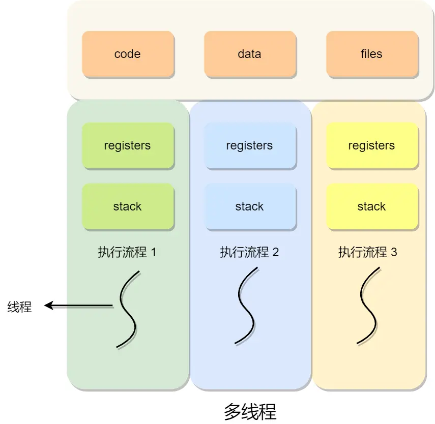

# Thread

**线程是进程当中的一条执行流程。**

同一个进程内多个线程之间可以共享代码段、数据段、打开的文件等资源，但每个线程各自都有一套独立的寄存器和栈，这样可以确保线程的控制流是相对独立的。

线程的优点：

* 一个进程中可以同时存在多个线程；
* 各个线程之间可以并发执行；
* 各个线程之间可以共享地址空间和文件等资源；

线程的缺点：

* 当进程中的一个线程崩溃时，会导致其所属进程的所有线程崩溃（这里是针对 C/C++ 语言，Java语言中的线程奔溃不会造成进程崩溃。

举个例子，对于游戏的用户设计，则不应该使用多线程的方式，否则一个用户挂了，会影响其他同个进程的线程。

## 线程通信间的方式

同个进程下的线程之间都是共享进程的资源，只要是共享变量都可以做到线程间通信，比如全局变量，所以对于线程间关注的不是通信方式，而是关注多线程竞争共享资源的问题，信号量也同样可以在线程间实现互斥与同步：

* 互斥的方式，可保证任意时刻只有一个线程访问共享资源；
* 同步的方式，可保证线程 A 应在线程 B 之前执行；

## 多线程冲突

### 竞争与协作 <a href="#jing-zheng-yu-xie-zuo" id="jing-zheng-yu-xie-zuo"></a>

在单核 CPU 系统里，为了实现多个程序同时运行的假象，操作系统通常以时间片调度的方式，让每个进程执行每次执行一个时间片，时间片用完了，就切换下一个进程运行，由于这个时间片的时间很短，于是就造成了「并发」的现象。

另外，操作系统也为每个进程创建巨大、私有的虚拟内存的假象，这种地址空间的抽象让每个程序好像拥有自己的内存，而实际上操作系统在背后秘密地让多个地址空间「复用」物理内存或者磁盘。

如果一个程序只有一个执行流程，也代表它是单线程的。当然一个程序可以有多个执行流程，也就是所谓的多线程程序，线程是调度的基本单位，进程则是资源分配的基本单位。所以，线程之间是可以共享进程的资源，比如代码段、堆空间、数据段、打开的文件等资源，但每个线程都有自己独立的栈空间。

<figure><figcaption><p>thread_multiple</p></figcaption></figure>

多个线程如果竞争共享资源，如果不采取有效的措施，则会造成共享数据的混乱。

#### 互斥

由于多线程执行操作共享变量的这段代码可能会导致竞争状态，因此我们将此段代码称为**临界区（**_**critical section**_**），它是访问共享资源的代码片段，一定不能给多线程同时执行。**

我们希望这段代码是**互斥（**_**mutualexclusion**_**）的，也就说保证一个线程在临界区执行时，其他线程应该被阻止进入临界区**，就是这段代码执行过程中，最多只能出现一个线程。

#### 同步

我们都知道在多线程里，每个线程并不一定是顺序执行的，它们基本是以各自独立的、不可预知的速度向前推进，但有时候我们又希望多个线程能密切合作，以实现一个共同的任务。

例子，线程 1 是负责读入数据的，而线程 2 是负责处理数据的，这两个线程是相互合作、相互依赖的。线程 2 在没有收到线程 1 的唤醒通知时，就会一直阻塞等待，当线程 1 读完数据需要把数据传给线程 2 时，线程 1 会唤醒线程 2，并把数据交给线程 2 处理。

**所谓同步，就是并发进程/线程在一些关键点上可能需要互相等待与互通消息，这种相互制约的等待与互通信息称为进程/线程同步**。

注意，同步与互斥是两种不同的概念：

* 同步就好比：「操作 A 应在操作 B 之前执行」，「操作 C 必须在操作 A 和操作 B 都完成之后才能执行」等；
* 互斥就好比：「操作 A 和操作 B 不能在同一时刻执行」；

### 互斥和同步实现

为了实现进程/线程间正确的协作，操作系统必须提供实现进程协作的措施和方法，主要的方法有两种：

* _锁_：加锁、解锁操作；
* _信号量_：P、V 操作；

这两个都可以方便地实现进程/线程互斥，而信号量比锁的功能更强一些，它还可以方便地实现进程/线程同步。

#### 锁 <a href="#suo" id="suo"></a>

使用加锁操作和解锁操作可以解决并发线程/进程的互斥问题。

任何想进入临界区的线程，必须先执行加锁操作。若加锁操作顺利通过，则线程可进入临界区；在完成对临界资源的访问后再执行解锁操作，以释放该临界资源。

#### 信号量 <a href="#xin-hao-liang" id="xin-hao-liang"></a>

信号量是操作系统提供的一种协调共享资源访问的方法。

通常**信号量表示资源的数量**，对应的变量是一个整型（`sem`）变量。

另外，还有**两个原子操作的系统调用函数来控制信号量的**，分别是：

* _P 操作_：将 `sem` 减 `1`，相减后，如果 `sem < 0`，则进程/线程进入阻塞等待，否则继续，表明 P 操作可能会阻塞；
* _V 操作_：将 `sem` 加 `1`，相加后，如果 `sem <= 0`，唤醒一个等待中的进程/线程，表明 V 操作不会阻塞；

P 操作是用在进入临界区之前，V 操作是用在离开临界区之后，这两个操作是必须成对出现的。

注：该操作在编程语言中，如Java中Semaphore

## 线程崩了，进程会如何

一般来说如果线程是因为非法访问内存引起的崩溃，那么进程肯定会崩溃，为什么系统要让进程崩溃呢，这主要是因为在进程中，**各个线程的地址空间是共享的**，既然是共享，那么某个线程对地址的非法访问就会导致内存的不确定性，进而可能会影响到其他线程，这种操作是危险的，操作系统会认为这很可能导致一系列严重的后果，于是干脆让整个进程崩溃

线程共享代码段，数据段，地址空间，文件。非法访问内存有以下几种情况，以 C 语言举例。

1. 针对只读内存写入数据
2. 访问了进程没有权限访问的地址空间（比如内核空间）
3. 访问了不存在的内存

```c
#include <stdio.h>
#include <stdlib.h>
   
int main() {
  char *s = "hello world";
  // 向只读内存写入数据，崩溃
  s[1] = 'H';
}


int main() {
  int *p = (int *)0xC0000fff;
  // 在32位虚拟地址空间中，p指向的是内核空间，显然不具有写入权限，所以上述赋值操作会导致崩溃
  // 针对进程的内核空间写入数据，崩溃
  *p = 10;
}


int main() {
  int *a = NULL;
  // 访问了不存在的内存
  *a = 1;
}
```

以上错误都是访问内存时的错误，所以统一会报 Segment Fault 错误（即段错误），这些都会导致进程崩溃

### 进程是如何崩溃的-信号机制 <a href="#jin-cheng-shi-ru-he-beng-kui-de-xin-hao-ji-zhi-jian-jie" id="jin-cheng-shi-ru-he-beng-kui-de-xin-hao-ji-zhi-jian-jie"></a>

那么线程崩溃后，进程是如何崩溃的呢，这背后的机制到底是怎样的，答案是**信号**。

kill信号的机制如下

1. CPU 执行正常的进程指令
2. 调用 kill 系统调用向进程发送信号
3. 进程收到操作系统发的信号，CPU 暂停当前程序运行，并将控制权转交给操作系统
4. 调用 kill 系统调用向进程发送信号（假设为 11，即 SIGSEGV，一般非法访问内存报的都是这个错误）
5. **操作系统根据情况执行相应的信号处理程序（函数），一般执行完信号处理程序逻辑后会让进程退出**

注意上面的第五步，如果进程没有注册自己的信号处理函数，那么操作系统会执行默认的信号处理程序（一般最后会让进程退出），但如果注册了，则会执行自己的信号处理函数，这样的话就给了进程一个垂死挣扎的机会，它收到 kill 信号后，可以调用 exit() 来退出，**但也可以使用 sigsetjmp，siglongjmp 这两个函数来恢复进程的执行**

也就是说虽然给进程发送了 kill 信号，但如果进程自己定义了信号处理函数或者无视信号就有机会逃出生天，当然了 kill -9 命令例外，不管进程是否定义了信号处理函数，都会马上被干掉。

一道经典面试题：**如何让正在运行的 Java 工程的优雅停机？**

通过上面的介绍大家不难发现，其实是 JVM 自己定义了信号处理函数，这样当发送 kill pid 命令（默认会传 15 也就是 SIGTERM）后，JVM 就可以在信号处理函数中执行一些资源清理之后再调用 exit 退出。

这种场景显然不能用 kill -9，不然一下把进程干掉了资源就来不及清除了。

### 为什么线程崩溃不会导致 JVM 进程崩溃 <a href="#wei-shen-me-xian-cheng-beng-kui-bu-hui-dao-zhi-jvm-jin-cheng-beng-kui" id="wei-shen-me-xian-cheng-beng-kui-bu-hui-dao-zhi-jvm-jin-cheng-beng-kui"></a>

现在我们再来看看这个问题，在 Java 中有哪些是常见的由于非法访问内存而产生的 Exception 或 error 呢，常见的是大家熟悉的 StackoverflowError 或者 NPE（NullPointerException）,NPE 我们都了解，属于是访问了不存在的内存。

#### Stackoverflow

但为什么栈溢出（Stackoverflow）也属于非法访问内存呢，这得简单聊一下进程的虚拟空间，也就是共享地址空间。现代操作系统为了保护进程之间不受影响，所以使用了虚拟地址空间来隔离进程，进程的寻址都是针对虚拟地址，每个进程的虚拟空间都是一样的，而线程会共用进程的地址空间。

32 位虚拟空间，进程的虚拟空间分布如下：

<figure><figcaption><p>32 process virtual space</p></figcaption></figure>

进程每调用一个函数，都会分配一个栈桢，然后在栈桢里会分配函数里定义的各种局部变量。

假设现在调用了一个无限递归的函数，那就会持续分配栈帧，但 stack 的大小是有限的（Linux 中默认为 8 M，可以通过 ulimit -a 查看），如果无限递归很快栈就会分配完了，此时再调用函数试图分配超出栈的大小内存，就会发生段错误，也就是 stackoverflowError。

#### 为什么非法访问内存，jvm不会崩

那问题来了，既然 StackoverflowError 或者 NPE 都属于非法访问内存， JVM 为什么不会崩溃呢？

其实就是**因为 JVM 自定义了自己的信号处理函数，拦截了 SIGSEGV 信号，针对这两者不让它们崩溃**。

### openJDK 源码解析 <a href="#openjdk-yuan-ma-jie-xi" id="openjdk-yuan-ma-jie-xi"></a>

在启动 JVM 的时候，设置了信号处理函数，收到 SIGSEGV，SIGPIPE 等信号后最终会调用 JVM\_handle\_linux\_signal 这个自定义信号处理函数，再来看下这个函数的主要逻辑。

```java
JVM_handle_linux_signal(int sig,
                        siginfo_t* info,
                        void* ucVoid,
                        int abort_if_unrecognized) {

   // Must do this before SignalHandlerMark, if crash protection installed we will longjmp away
  // 这段代码里会调用 siglongjmp，主要做线程恢复之用
  os::ThreadCrashProtection::check_crash_protection(sig, t);

  if (info != NULL && uc != NULL && thread != NULL) {
    pc = (address) os::Linux::ucontext_get_pc(uc);

    // Handle ALL stack overflow variations here
    if (sig == SIGSEGV) {
      // Si_addr may not be valid due to a bug in the linux-ppc64 kernel (see
      // comment below). Use get_stack_bang_address instead of si_addr.
      address addr = ((NativeInstruction*)pc)->get_stack_bang_address(uc);

      // 判断是否栈溢出了
      if (addr < thread->stack_base() &&
          addr >= thread->stack_base() - thread->stack_size()) {
        if (thread->thread_state() == _thread_in_Java) {            // 针对栈溢出 JVM 的内部处理
            stub = SharedRuntime::continuation_for_implicit_exception(thread, pc, SharedRuntime::STACK_OVERFLOW);
        }
      }
    }
  }

  if (sig == SIGSEGV &&
               !MacroAssembler::needs_explicit_null_check((intptr_t)info->si_addr)) {
         // 此处会做空指针检查
      stub = SharedRuntime::continuation_for_implicit_exception(thread, pc, SharedRuntime::IMPLICIT_NULL);
  }


  // 如果是栈溢出或者空指针最终会返回 true，不会走最后的 report_and_die，所以 JVM 不会退出
  if (stub != NULL) {
    // save all thread context in case we need to restore it
    if (thread != NULL) thread->set_saved_exception_pc(pc);

    uc->uc_mcontext.gregs[REG_PC] = (greg_t)stub;
    // 返回 true 代表 JVM 进程不会退出
    return true;
  }

  VMError err(t, sig, pc, info, ucVoid);
  // 生成 hs_err_pid_xxx.log 文件并退出
  err.report_and_die();

  ShouldNotReachHere();
  return true; // Mute compiler

}
```

从以上代码我们可以知道以下信息：

1. 发生 stackoverflow 还有空指针错误，确实都发送了 SIGSEGV，只是虚拟机不选择退出，而是自己内部作了额外的处理，其实是恢复了线程的执行，并抛出 StackoverflowError 和 NPE，这就是为什么 JVM 不会崩溃且我们能捕获这两个错误/异常的原因
2. 如果针对 SIGSEGV 等信号，在以上的函数中 JVM 没有做额外的处理，那么最终会走到 report\_and\_die 这个方法，这个方法主要做的事情是生成 hs\_err\_pid\_xxx.log crash 文件（记录了一些堆栈信息或错误），然后退出

至此我相信大家明白了为什么发生了 StackoverflowError 和 NPE 这两个非法访问内存的错误，JVM 却没有崩溃。

**原因其实就是虚拟机内部定义了信号处理函数，而在信号处理函数中对这两者做了额外的处理以让 JVM 不崩溃，另一方面也可以看出如果 JVM 不对信号做额外的处理，最后会自己退出并产生 crash 文件 hs\_err\_pid\_xxx.log（可以通过 -XX:ErrorFile=/var/**_**log**_**/hs\_err.log 这样的方式指定），这个文件记录了虚拟机崩溃的重要原因**。

所以也可以说，虚拟机是否崩溃只要看它是否会产生此崩溃日志文件

## 进程最多可创建多少线程

这个问题跟两个东西有关系：

* **进程的虚拟内存空间上限**，因为创建一个线程，操作系统需要为其分配一个栈空间，如果线程数量越多，所需的栈空间就要越大，那么虚拟内存就会占用的越多。
* **系统参数限制**，虽然 Linux 并没有内核参数来控制单个进程创建的最大线程个数，但是有系统级别的参数来控制整个系统的最大线程个数。

在进程里创建一个线程需要消耗多少虚拟内存大小？我们可以执行 ulimit -a 这条命令，查看进程创建线程时默认分配的栈空间大小。

#### 32位

在 32 位 Linux 系统里，一个进程的虚拟空间是 4G，内核分走了1G，**留给用户用的只有 3G**。那么假设创建一个线程需要占用 10M 虚拟内存，总共有 3G 虚拟内存可以使用。于是我们可以算出，最多可以创建差不多 300 个（3G/10M）左右的线程。

如果想使得进程创建上千个线程，那么我们可以调整创建线程时分配的栈空间大小，比如调整为 512k：

```sh
ulimit -s 512
```

#### 64位

64 位系统意味着用户空间的虚拟内存最大值是 128T，这个数值是很大的，如果按创建一个线程需占用 10M 栈空间的情况来算，那么理论上可以创建 128T/10M 个线程，也就是 1000多万个线程，有点魔幻！

所以按 64 位系统的虚拟内存大小，理论上可以创建无数个线程。

事实上，肯定创建不了那么多线程，除了虚拟内存的限制，还有系统的限制。

比如下面这三个内核参数的大小，都会影响创建线程的上限：

* _**/proc/sys/kernel/threads-max**_，表示系统支持的最大线程数，默认值是 `14553`；
* _**/proc/sys/kernel/pid\_max**_，表示系统全局的 PID 号数值的限制，每一个进程或线程都有 ID，ID 的值超过这个数，进程或线程就会创建失败，默认值是 `32768`；
* _**/proc/sys/vm/max\_map\_count**_，表示限制一个进程可以拥有的VMA(虚拟内存区域)的数量，具体什么意思我也没搞清楚，反正如果它的值很小，也会导致创建线程失败，默认值是 `65530`。

如果将上述参数放开，则可以突破以上上线，根据服务器cpu性能瓶颈，创建超过14553甚至32768个线程。

另一种方式，把创建线程时分配的栈空间调大，比如调大为 100M，因为在大就会创建线程失败。在这种情况下不断创建线程，创建了2w多个线程，然后就无法继续创建了，而且该进程的虚拟内存空间已经高达 25T，要知道这台服务器的物理内存才 2G。

为什么物理内存只有 2G，进程的虚拟内存却可以使用 25T 呢？

因为虚拟内存并不是全部都映射到物理内存的，程序是有局部性的特性，也就是某一个时间只会执行部分代码，所以只需要映射这部分程序就好。

#### 总结

* 32 位系统，用户态的虚拟空间只有 3G，如果创建线程时分配的栈空间是 10M，那么一个进程最多只能创建 300 个左右的线程。
* 64 位系统，用户态的虚拟空间大到有 128T，理论上不会受虚拟内存大小的限制，而会受系统的参数或性能限制。
