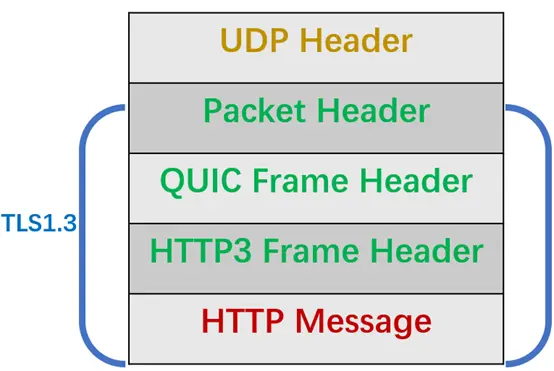

# UDP

## UDP报文

<figure><figcaption>
udp_head
</figcaption></figure>

## 基于UDP实现可靠传输

目前基于UDP实现可靠传输的方案就是QUIC协议，并且已经应用到HTTP/3了。

### QUIC

想要基于UDP实现可靠传输，那么就要在应用层入手，设计好协议头。

HTTP/3，在UDP报文和HTTP消息直接，有三层头部：

<figure><figcaption>
udp_quic
</figcaption></figure>

#### Packet Header

Packet Header 首次建立连接和日常传输时使用的Header是不同的

* Long Packet Header 用于首次建立连接
* Short Packet Header 用于日常传输数据

<figure><figcaption>
packet_header
</figcaption></figure>

QUIC也是需要三次握手来建立连接，主要是为了协商连接ID。协商出连接ID后，后续传输时，双方只需要固定连接ID，从而实现迁移功能。

Short Packet Header中的Packet Number时每个报文独一无二的变化，严格递增，就算Packet N丢失了，重传的Packet N是一个比N大的数。

单调递增的好处

* 可以更精确计算RTT，没有TCP重传的歧义性问题
* 可以支持乱序确认，因为丢包重传将当前窗口阻塞在原地，而TCP必须是顺序确认的，丢包时会导致窗口不滑动。

#### QUIC Frame Header

个Packet报文中可以存放多个QUIC Frame。

每一个Frame都有明确类型，类型不同，功能也不同。其中Stream类型的Frame格式，可以认为是一个HTTP请求。

<figure><figcaption>
quic_frame_stream
</figcaption></figure>


前面的Packet Header，重传报文的Packet Number是递增的，与丢失的编号不一致，如何确定这两个数据包内容一样?


所以引入Frame Header这一层，通过Stream ID + Offset 字段实现数据的有序性，通过比较两个数据包Stream ID与Stream Offset，如果一致，就说明数据包内容一致。

### QUIC解决队列头阻塞

QUIC借鉴了HTTP/2里Stream的概念，在一个QUIC连接里可以并发多个HTTP请求

但是QUIC给每一个Stream都分配了一个独立的滑动窗口，这样使得一个连接上的多个Stream直接没有依赖关系，都是相互独立的。

<figure><figcaption>
quic_stream_block
</figcaption></figure>

假设Stream2丢了一个UDP包，只会影响Stream2的处理，不会影响其他Stream。

### QUIC做流量控制

QUIC实现了两种级别的流量控制，分别为Stream和Connection两种级别

* Stream级别：Stream可以认为就是一条HTTP请求，每个Stream都有独立的滑动窗口，所以每个Stream都可以做流量控制
* Connection级别：限制连接中所有Stream相加起来的总字节数，防止发送方超过连接的缓冲容量。

